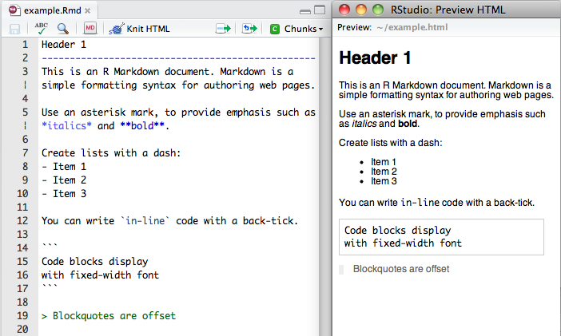
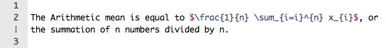

<!-- to compile this:
library("rmarkdown");
render("rr-auhtoring.Rmd", output_format="all")
or just call make
-->

```{r style, echo=FALSE, message=FALSE, warning=FALSE, results="asis"}
library("knitr")
#options(width=100)
opts_chunk$set(message = FALSE, error = TRUE, warning = TRUE)
```


# Introduction

> **Objectives**
>
> * Understand the concept of dynamic documents are reproducible research
> * Learn `R` markdown basics
> * Produce a simple vignette

> This content is adapted from the
> [RStudio `R` Markdown - Dynamic Documents of R](http://rmarkdown.rstudio.com/),
> [Markdown basics](http://rmarkdown.rstudio.com/authoring_basics.html)
> and
> [R code chunks](http://rmarkdown.rstudio.com/authoring_rcodechunks.html)
> tutorials.

This session introduces tools to author documents that include
dynamically generated analysis results (tables, figures, ...) produced
with `R`. Bringing data, results and their interpretation together in
a single, coherent document is invaluable to keep track of long and
complex analyses, assure reproducibility of the pipeline and the final
report (any updates at the data or analysis level are propagated at
the report level) and to comprehensively communicate these results to
collaborators. A popular solution for this is *literate programming*,
a technique and set of tools that permit to

1. Write text and code within a single document. Here we will use the
   simple *markdown* syntax and include `R` code chunks; such documents
   are denoted *R markdown* documents and have the `Rmd`
   extension. More on this in the next section.
2. Extract and execute the code: this is called *tangling*.
3. Replace the code chunks with their output into the original
   document: this is called *weaving*.
4. Render the document into a final, easily read format such as pdf or
   html.

Steps 2 to 4 are can be executed individually or automated into a
single command such as `knitr::knit2html` (i.e. function `knit2html`
from the package `knitr`) or `rmarkdown::render`, or using the RStudio
editor.

Other types of document and frameworks that combine a programming and
authoring languages are `Sweave` files (with `Rnw` extension, that
combine LaTeX and `R`),
[Jupyter](http://jupyter.org)/[IPython](http://ipython.org/) for
python, `R` and other languages,
[orgmode](http://orgmode.org/manual/Working-With-Source-Code.html#Working-With-Source-Code)
...

# `R` Markdown

R Markdown is an authoring format that enables easy creation of
dynamic documents, presentations, and reports from R. It combines the
core syntax of
[markdown](http://daringfireball.net/projects/markdown/basics) (an
easy-to-write plain text format) with embedded `R` code chunks. `R`
Markdown documents are fully *reproducible* (they can be automatically
regenerated whenever underlying `R` code or data changes).

This document describes `R` Markdown v2 based on
[knitr](http://yihui.name/knitr/) and
[`pandoc`](http://johnmacfarlane.net/pandoc/), the workhorse that
converts markdown to html and many other formats. We will focus the
generation of reports such this document in html and pdf, although
other formats and type of documents are available.

Note that PDF output requires a full installation of TeX and that
pandoc is a third party application that needs to be installed outside
of `R` unless you use RStudio, which bundles all necessary `R` packages
and `pandoc`.

> **Tip**
>
> We would also like to warn against using MS Word as output document,
> as this breaks the support for reproducibility. The final,
> compiled document should be used for rendering only (which is
> implicit for html of pdf files); editing should be performed on the
> original documents, i.e the `Rmd` file.

## Installation

You can install the the required package from CRAN as follows:

```{r, eval=FALSE}
install.packages("knitr")
install.packages("rmarkdown")
```

These packages are pre-installed with RStudio.

## Markdown basics

The figure below, taken from
[the RStudio markdown (v2) tutorial](http://rmarkdown.rstudio.com/authoring_pandoc_markdown.html)
illustrates basic markdown syntax and its output using RStudio.

- Section headers can be defined using `======` or `-----` (level 1
  and 2 respectively) or one or multiple `#` (for level 1, 2,
  ... respectively).

- Italic and bold fonts are defined using one to two `*` around the
  text.

- Bullet lists items start with a `-`.

- In-line code and verbatim expression are surrounded by back ticks `` ` ``.

- Code blocks start and end with three back ticks.

- Starting a line with `>` offsets the text. 



## File header

R Markdown version 2 uses an *optional* header to define, among other
things, the title, author and output formats of the `R` Markdown
document. Below, we want to use `html` as final format; replace with
`pdf_document` to produce a pdf report.

```
---
title: "Title comes here"
author: "Your name"
date: "12 June 2015"
output: html_document
---
```

## From `Rmd` to `html` (or `pdf`)

If you are using RStudio, the simplest way to generate your final
output is to open your `Rmd` file and click the `Knit HTML` (or `Knit
PDF`, ...) button.

From `R`, you can use the `knitr::knit2html` or `rmarkdown::render`
functions and give the `Rmd` source file as input.

1. Both options will first use the `knitr::knit` function to *weave*
the document and generate the markdown `md` file that includes the
code outputs.

2. The rendering of the final output document will be done using
`markdown::markdownToHTML` (in case of `knitr::knit2html`), or the more
recent `rmarkdown::render`.

```{r knitit, eval=FALSE}
library("knitr")
knit2html("my_rr_document.Rmd")
```

```{r renderit, eval=FALSE}
library("rmarkdown")
render("my_rr_document.Rmd") ## default output is html
render("my_rr_document.Rmd", output_format = "html_document") 
```

For pdf outputs using `knitr`

```{r knititpdf, eval=FALSE}
knit2pdf("my_rr_document.Rmd")
```

or `rmakdown`

```{r renderitpdf, eval=FALSE}
library("rmarkdown")
render("my_rr_document.Rmd", output_format = "pdf_document")
```

And, to render all output formats defined in the header

```{r renderall, eval=FALSE}
render("my_rr_document.Rmd", output_format = "all") 
```

---------------------

> **Exercise:** Experiment with `R` markdown and the features
> described so far. To create your starting document, create a new `R
> Markdown` file using the RStudio menu or copy/paste the template
> below.

```
---
title: "Title comes here"
author: "Your name"
date: "12 June 2015"
output: html_document
---

This is an `R` Markdown document. Markdown is a simple formatting syntax
for authoring HTML, PDF, and MS Word documents. For more details on
using `R` Markdown see <http://rmarkdown.rstudio.com>.

When you click the **Knit** button a document will be generated that
includes both content as well as the output of any embedded `R` code
chunks within the document. You can embed an `R` code chunk like this:
```

---------------------

## More markdown syntax

### Emphasis

You can use `*` or `_` to format *italic* and  **bold** text.

```
*italic*   **bold**

_italic_   __bold__
```

### Headers

```
## Header 2

### Header 3
```

### Lists

Unordered List:
```
* Item 1
* Item 2
    + Item 2a
    + Item 2b
```
Ordered List:
```
1. Item 1
2. Item 2
3. Item 3
    + Item 3a
    + Item 3b
```

### Links

To use links, enclose the link text in `[]` and the the actual link in
`()`: ` [my link](http://linkurl.com) ` or use a plain http address:
```
http://example.com

[linked phrase](http://example.com)
```

### Images

To add a static figure to the document, use the link syntax and
precede it by `!`: `  `.

Image source can be on-line or local files.

```


```

### Block quotes

A friend once said:

> It's always better to give
> than to receive.

```
A friend once said:

> It's always better to give than to receive.
```

### Plain code 

Plain code blocks are displayed in a fixed-width font but not
evaluated (see below for evaluation of code blocks), use 3 back ticks
(see figure above)

```
This text is displayed verbatim / preformatted
```

We can also define `in-line` code using single back ticks.

```
We can also define `in-line` code using single back ticks.
```

### Horizontal Rule / Page Break

Three or more asterisks or dashes:
```
******

------
```

### Tables

There is a simple markdown syntax to produce adequately formatted tables:

First Header  | Second Header
------------- | -------------
Content Cell  | Content Cell
Content Cell  | Content Cell
Content Cell  | Content Cell

which is produced with

```
First Header  | Second Header
------------- | -------------
Content Cell  | Content Cell
Content Cell  | Content Cell
Content Cell  | Content Cell
```

### Embedding Equations

You can embed LaTeX or MathML equations in `R` Markdown files using the
following syntax:

* `$equation$` for inline equations (note there must not be white
  space adjacent to the `$` delimiters)
* `$$ equation $$` for display equations
* `<math>...</math>` for MathML equations.

For example:



### Super- and subscripts

H~2~O is a liquid.  2^10^ is 1024.

```
H~2~O is a liquid.  2^10^ is 1024.
```

---------------------

> **Exercise:** Complement you `Rmd` file with some new syntax
> elements.

---------------------

## `R` code chunks

To include `R` code in the `R` markdown file, the native code chunk
syntax is augmented with code chunk tags inside `{r, ...}`, as
illustrated below:


The following code chunk options are available:

- `{r chunkname}` the first unnamed string is used to name the code
  chunk; useful for following the code execution and debugging.

- `{r, eval=TRUE}` by default the code in the chunk is
  executed. Alternatively, set `eval=FALSE`.

- `{r, echo=TRUE}` by default, the code is displayed before the
  output. Use `echo=FALSE` to hide the code chunk content.

- Control if messages, warnings or errors are to be displayed with
  `{r, message=TRUE, warning=TRUE, error=TRUE}` or `FALSE`.

- Figure dimensions can be controlled with `fig.height` and
  `fig.width`.

- To avoid wasting time in repeating long calculations over and over
  again, it is possible to cache specific code chunks specifying
  `cache=TRUE` in the chunk header.

- To execute in-line code, use `` ` r 1+1` `` (no space in front of
  the `r`, though).

Tables can easily be printed inside an code chunk. Below, we
explicitly create and use a `data.frame`. 

```{r table, message=FALSE}
dfr <- data.frame(name = c("John", "David", "Caroline", "Igor"),
                  id = c(123, 234, 321, 231),
                  gender = c("M", "M", "F", "M"))
dfr
```

Tables produced in `R` as data frames or matrices can be rendered with
the helper function `knitr::kable` and are then displayed accordingly.

```{r table2}
library("knitr")
kable(dfr)
```

---------------------

> **Exercise:** Using the `iris` data set, create a reproducible
> report that documents the data (dimensions, summary statistics, ...)
> and provides a set of visualisations (a PCA plot, `pairs`, ...). To
> conclude your report, add a *Session information* section with the
> output of `sessionInfo()`.

---------------------

# Next steps

- Publishing your `R` markdown documents on the web with
  [RPubs](http://rpubs.com/).
- Using `R` markdown to create package vignettes.
- Source code and `R` markdown documents versioning using, for example,
  `git` and [GitHub](https://github.com/).
- Producing dynamic documents with
  [`shiny`](http://shiny.rstudio.com/) (there will be a dedicated lab
  on `shiny`).

# References

- The [`knitr`](http://yihui.name/knitr/) package, including excellent
  documentation.
- [`markdown`](http://cran.r-project.org/web/packages/markdown/index.html)
  and [`rmarkdown`](https://github.com/rstudio/rmarkdown/) packages
- [R markdown](http://rmarkdown.rstudio.com/) documentation
- [R markdown video](http://vimeo.com/94181521)

# Session information

```{r, echo=FALSE}
sessionInfo()
```

