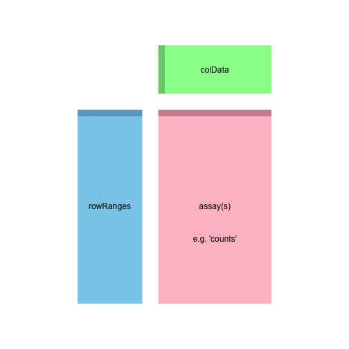
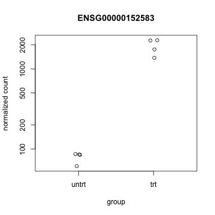
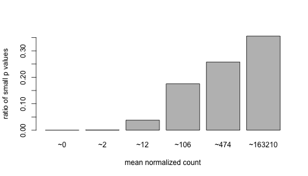

<!-- to compile this: library("knitr"); knit2html("rnaseqCSAMA.Rmd") -->

<!--
     # a list of all required libraries:
     reqlibs = sub(".*library\\(\"(.*?)\"\\).*","\\1",grep("library\\(",readLines("rnaseqCSAMA.Rmd"),value=TRUE))
     find.package(reqlibs)
-->

# End-to-end RNA-Seq workflow

Michael Love [1], Simon Anders [2], Wolfgang Huber [2]

[1] Department of Biostatistics, Dana-Farber Cancer Institute and
Harvard T.H. Chan School of Public Health, Boston, US; 

[2] European Molecular Biology Laboratory (EMBL), Heidelberg, Germany.

<script type="text/javascript">
document.addEventListener("DOMContentLoaded", function() {
  document.querySelector("h1").style.marginTop = "0";
});
</script>
<script type="text/javascript">
document.addEventListener("DOMContentLoaded", function() {
  var links = document.links;  
  for (var i = 0, linksLength = links.length; i < linksLength; i++)
    if (links[i].hostname != window.location.hostname)
      links[i].target = '_blank';
});
</script>

## Contents

* [Counting reads](#count) 
* [Building a DESeqDataSet](#construct)
* [Visual exploration](#eda)
* [Differential expression](#de)
* [Diagnostic plots](#diagnostic)
* [Annotation](#annotate)
* [ReportingTools](#report)
* [Ease of exchanging methods](#methods)

## Introduction

This lab will walk you through an end-to-end RNA-Seq differential
expression workflow, using *[DESeq2](http://bioconductor.org/packages/release/bioc/html/DESeq2.html)* along with other
Bioconductor packages.  We will start from the FASTQ files, show how
these were aligned to the reference genome, prepare gene expression
values as a count matrix by counting the sequenced fragments, perform
exploratory data analysis (EDA), perform differential gene expression
analysis with *DESeq2*, and visually explore the results.

We note that a number of other Bioconductor packages can also be used for
statistical inference of differential expression at the gene level including
*[edgeR](http://bioconductor.org/packages/release/bioc/html/edgeR.html)*, *[BaySeq](http://bioconductor.org/packages/release/bioc/html/BaySeq.html)*, *[DSS](http://bioconductor.org/packages/release/bioc/html/DSS.html)* and
*[limma](http://bioconductor.org/packages/release/bioc/html/limma.html)*.

If you have questions about this workflow, please post them to the
[Bioconductor support site](https://support.bioconductor.org/).
If the questions concern a specific package, you can tag the post with the name of the package,
or for general questions about the workflow, tag the post with `deseq2`. Note the
[posting guide](http://www.bioconductor.org/help/support/posting-guide/)
for crafting an optimal question for the support site.

## Experimental data

The data used in this workflow is an RNA-Seq experiment of airway
smooth muscle cells treated with dexamethasone, a synthetic
glucocorticoid steroid with anti-inflammatory effects. Glucocorticoids
are used, for example, in asthma patients to prevent or reduce
inflammation of the airways. In the experiment, four primary human
airway smooth muscle cell lines were treated with 1 micromolar
dexamethasone for 18 hours. For each of the four cell lines, we have a
treated and an untreated sample. The reference for the experiment is:

Himes BE, Jiang X, Wagner P, Hu R, Wang Q, Klanderman B, Whitaker RM,
Duan Q, Lasky-Su J, Nikolos C, Jester W, Johnson M, Panettieri R Jr,
Tantisira KG, Weiss ST, Lu Q. "RNA-Seq Transcriptome Profiling
Identifies CRISPLD2 as a Glucocorticoid Responsive Gene that Modulates
Cytokine Function in Airway Smooth Muscle Cells." PLoS One. 2014 Jun
13;9(6):e99625.
PMID: [24926665](http://www.ncbi.nlm.nih.gov/pubmed/24926665).
GEO: [GSE52778](http://www.ncbi.nlm.nih.gov/geo/query/acc.cgi?acc=GSE52778).

## Preparing count matrices

As input, the *DESeq2* package expects count data as obtained,
e.g., from RNA-Seq or another high-throughput sequencing experiment,
in the form of a matrix of integer values. The value in the *i*-th row
and the *j*-th column of the matrix tells how many reads have been
mapped to gene *i* in sample *j*.  Analogously, for other types of
assays, the rows of the matrix might correspond e.g., to binding
regions (with ChIP-Seq) or peptide sequences (with quantitative mass
spectrometry).

The count values must be raw counts of sequencing reads. This is
important for *DESeq2*'s statistical model to hold, as only the
actual counts allow assessing the measurement precision
correctly. Hence, please do not supply other quantities, such as
(rounded) normalized counts, or counts of covered base pairs -- this
will only lead to nonsensical results.

## Aligning reads to a reference

The computational analysis of an RNA-Seq experiment begins earlier:
what we get from the sequencing machine is a set of FASTQ files that
contain the nucleotide sequence of each read and a quality score at
each position.  These reads must first be aligned to a reference
genome or transcriptome.  It is important to know if the sequencing
experiment was single-end or paired-end, as the alignment software
will require the user to specify both FASTQ files for a paired-end
experiment. The output of this alignment step is commonly stored in a
file format called [SAM/BAM](http://samtools.github.io/hts-specs).

A number of software programs exist to align reads to the reference
genome, and the development is too rapid for this document to provide
an up-to-date list. We recommend consulting benchmarking papers that
discuss the advantages and disadvantages of each software, which
include accuracy, ability to align reads over splice junctions, speed,
memory footprint, and many other features.

The reads for this experiment were aligned to the Ensembl release 75 human reference
genome using the
[STAR read aligner](https://code.google.com/p/rna-star/):

```
for f in `cat files`; do STAR --genomeDir ../STAR/ENSEMBL.homo_sapiens.release-75 \
--readFilesIn fastq/$f\_1.fastq fastq/$f\_2.fastq \
--runThreadN 12 --outFileNamePrefix aligned/$f.; done
```

[SAMtools](http://samtools.sourceforge.net/) was used to generate BAM files.

```
cat files | parallel -j 7 samtools view -bS aligned/{}.Aligned.out.sam -o aligned/{}.bam
```

The BAM files for a number of sequencing runs can then be used to
generate count matrices, as described in the following section.

<a id="count"></a>

## Counting reads

Besides the main count matrix, which we will use later, the
*[airway](http://bioconductor.org/packages/release/data/experiment/html/airway.html)* package also contains a small subset of the raw
data, namely eight BAM file each with a subset of the reads. We will
use these files to demonstrate how a count matrix can be constructed
from BAM files. Afterwards, we will load the full count matrix
corresponding to all samples and all data, which is already provided
in the same package, and will continue the analysis with that full
table.

We load the data package with the example data:


```r
library("airway")
```

The R function *system.file* can be used to find out where on your
computer the files from a package have been installed. Here we ask for
the full path to the `extdata` directory, which is part of the
*[airway](http://bioconductor.org/packages/release/data/experiment/html/airway.html)* package.


```r
dir <- system.file("extdata", package="airway", mustWork=TRUE)
```

In this directory, we find the eight BAM files (and some other files):


```r
list.files(dir)
```

```
##  [1] "GSE52778_series_matrix.txt"       
##  [2] "Homo_sapiens.GRCh37.75_subset.gtf"
##  [3] "sample_table.csv"                 
##  [4] "SraRunInfo_SRP033351.csv"         
##  [5] "SRR1039508_subset.bam"            
##  [6] "SRR1039508_subset.bam.bai"        
##  [7] "SRR1039509_subset.bam"            
##  [8] "SRR1039512_subset.bam"            
##  [9] "SRR1039513_subset.bam"            
## [10] "SRR1039516_subset.bam"            
## [11] "SRR1039517_subset.bam"            
## [12] "SRR1039520_subset.bam"            
## [13] "SRR1039521_subset.bam"
```

Typically, we have a table with experimental metadata for our
samples. For your own project, you might create such a comma-separated
value (CSV) file using a text editor or spreadsheet software such as Excel.

We load this file with *read.csv*. The parentheses around the last
line are used to print the result in addition to storing it to the
`sampleTable` object.


```r
csvfile <- file.path(dir,"sample_table.csv")
(sampleTable <- read.csv(csvfile,row.names=1))
```

```
##            SampleName    cell   dex albut        Run avgLength Experiment
## SRR1039508 GSM1275862  N61311 untrt untrt SRR1039508       126  SRX384345
## SRR1039509 GSM1275863  N61311   trt untrt SRR1039509       126  SRX384346
## SRR1039512 GSM1275866 N052611 untrt untrt SRR1039512       126  SRX384349
## SRR1039513 GSM1275867 N052611   trt untrt SRR1039513        87  SRX384350
## SRR1039516 GSM1275870 N080611 untrt untrt SRR1039516       120  SRX384353
## SRR1039517 GSM1275871 N080611   trt untrt SRR1039517       126  SRX384354
## SRR1039520 GSM1275874 N061011 untrt untrt SRR1039520       101  SRX384357
## SRR1039521 GSM1275875 N061011   trt untrt SRR1039521        98  SRX384358
##               Sample    BioSample
## SRR1039508 SRS508568 SAMN02422669
## SRR1039509 SRS508567 SAMN02422675
## SRR1039512 SRS508571 SAMN02422678
## SRR1039513 SRS508572 SAMN02422670
## SRR1039516 SRS508575 SAMN02422682
## SRR1039517 SRS508576 SAMN02422673
## SRR1039520 SRS508579 SAMN02422683
## SRR1039521 SRS508580 SAMN02422677
```

Once the reads have been aligned, there are a number of tools which
can be used to count the number of reads which can be unambiguously
assigned to genomic features for each sample. These often take as
input SAM/BAM alignment files and a file specifying the genomic
features, e.g. a GFF3 or GTF file specifying the gene models.

The following tools can be used generate count matrices:

function            | package                                              | framework      | output                 | *DESeq2* input function
--------------------|------------------------------------------------------|----------------|------------------------|-------------------------
*summarizeOverlaps* | *[GenomicAlignments](http://bioconductor.org/packages/release/bioc/html/GenomicAlignments.html)*                     | R/Bioconductor | *SummarizedExperiment* | *DESeqDataSet*
*featureCounts*     | *[Rsubread](http://bioconductor.org/packages/release/bioc/html/Rsubread.html)*                              | R/Bioconductor | matrix                 | *DESeqDataSetFromMatrix*
*htseq-count*       | [HTSeq](http://www-huber.embl.de/users/anders/HTSeq) | Python         | files                  | *DESeqDataSetFromHTSeq* 

Using the `Run` column in the sample table, we construct the full
paths to the files we want to perform the counting operation on:


```r
filenames <- file.path(dir, paste0(sampleTable$Run, "_subset.bam"))
```

We indicate in Bioconductor that these files are BAM files using the
*BamFileList* function. Here we also specify details about how the BAM files should
be treated, e.g., only process 2000000 reads at a time.


```r
library("Rsamtools")
bamfiles <- BamFileList(filenames, yieldSize=2000000)
```

**Note:** make sure that the chromosome names of the genomic features
in the annotation you use are consistent with the chromosome names of
the reference used for read alignment. Otherwise, the scripts might
fail to count any reads to features due to the mismatching names.
We can check the chromosome names in the alignment files like so:


```r
seqinfo(bamfiles[1])
```

```
## Seqinfo object with 84 sequences from an unspecified genome:
##   seqnames   seqlengths isCircular genome
##   1           249250621       <NA>   <NA>
##   10          135534747       <NA>   <NA>
##   11          135006516       <NA>   <NA>
##   12          133851895       <NA>   <NA>
##   13          115169878       <NA>   <NA>
##   ...               ...        ...    ...
##   GL000210.1      27682       <NA>   <NA>
##   GL000231.1      27386       <NA>   <NA>
##   GL000229.1      19913       <NA>   <NA>
##   GL000226.1      15008       <NA>   <NA>
##   GL000207.1       4262       <NA>   <NA>
```

Next, we need to read in the gene model which will be used for
counting reads. We will read the gene model from a
[GTF file](http://www.ensembl.org/info/website/upload/gff.html), using
*makeTxDbFromGFF* from the *[GenomicFeatures](http://bioconductor.org/packages/release/bioc/html/GenomicFeatures.html)*
package. GTF files can be downloaded from
Ensembl's FTP site or other gene model repositories.
A *TranscriptDb* object is a database which can be used to
generate a variety of range-based objects, such as exons, transcripts,
and genes. We will want to make a list of exons grouped by gene.

There are other options for constructing a *TranscriptDB*.
For the *known genes* track from the UCSC Genome Browser,
one can use the pre-built Transcript DataBase:
*[TxDb.Hsapiens.UCSC.hg19.knownGene](http://bioconductor.org/packages/release/data/annotation/html/TxDb.Hsapiens.UCSC.hg19.knownGene.html)*.
The *makeTxDbFromBiomart* function can be used to automatically
pull a gene model from Biomart. 


```r
library("GenomicFeatures")
```


```r
gtffile <- file.path(dir,"Homo_sapiens.GRCh37.75_subset.gtf")
(txdb <- makeTxDbFromGFF(gtffile, format="gtf"))
```

```
## Warning in matchCircularity(seqlevels(gr), circ_seqs): None of the strings
## in your circ_seqs argument match your seqnames.
```

```
## TxDb object:
## # Db type: TxDb
## # Supporting package: GenomicFeatures
## # Data source: /Users/michael/Library/R/3.2/library/airway/extdata/Homo_sapiens.GRCh37.75_subset.gtf
## # Organism: NA
## # miRBase build ID: NA
## # Genome: NA
## # transcript_nrow: 65
## # exon_nrow: 279
## # cds_nrow: 158
## # Db created by: GenomicFeatures package from Bioconductor
## # Creation time: 2015-06-15 11:52:29 +0200 (Mon, 15 Jun 2015)
## # GenomicFeatures version at creation time: 1.20.1
## # RSQLite version at creation time: 1.0.0
## # DBSCHEMAVERSION: 1.1
```

The following line produces a *GRangesList* of all the exons grouped by gene.


```r
(genes <- exonsBy(txdb, by="gene"))
```

```
## GRangesList object of length 20:
## $ENSG00000009724 
## GRanges object with 18 ranges and 2 metadata columns:
##        seqnames               ranges strand   |   exon_id       exon_name
##           <Rle>            <IRanges>  <Rle>   | <integer>     <character>
##    [1]        1 [11086580, 11087705]      -   |        98 ENSE00000818830
##    [2]        1 [11090233, 11090307]      -   |        99 ENSE00000472123
##    [3]        1 [11090805, 11090939]      -   |       100 ENSE00000743084
##    [4]        1 [11094885, 11094963]      -   |       101 ENSE00000743085
##    [5]        1 [11097750, 11097868]      -   |       103 ENSE00003520086
##    ...      ...                  ...    ... ...       ...             ...
##   [14]        1 [11106948, 11107176]      -   |       111 ENSE00003467404
##   [15]        1 [11106948, 11107176]      -   |       112 ENSE00003489217
##   [16]        1 [11107260, 11107280]      -   |       113 ENSE00001833377
##   [17]        1 [11107260, 11107284]      -   |       114 ENSE00001472289
##   [18]        1 [11107260, 11107290]      -   |       115 ENSE00001881401
## 
## ...
## <19 more elements>
## -------
## seqinfo: 1 sequence from an unspecified genome; no seqlengths
```

After these preparations, the actual counting is easy. The function
*summarizeOverlaps* from the *[GenomicAlignments](http://bioconductor.org/packages/release/bioc/html/GenomicAlignments.html)*
package will do this. This produces a *SummarizedExperiment*
object, which contains a variety of information about
an experiment, and will be described in more detail below.

**Note:** If it is desired to perform counting using multiple cores, one can use
the *register* and *MulticoreParam* functions from the
*[BiocParallel](http://bioconductor.org/packages/release/bioc/html/BiocParallel.html)* package before the counting call below.


```r
library("GenomicAlignments")
```


```r
se <- summarizeOverlaps(features=genes, reads=bamfiles,
                        mode="Union",
                        singleEnd=FALSE,
                        ignore.strand=TRUE,
                        fragments=TRUE )
```

We specify a number of arguments besides the `features` and the
`reads`. The `mode` argument describes what kind of read overlaps will
be counted as a hit. These modes are shown in Figure 1 of the "Counting reads with
summarizeOverlaps" vignette for the *[GenomicAlignments](http://bioconductor.org/packages/release/bioc/html/GenomicAlignments.html)*
package. Setting `singleEnd` to `FALSE` indicates that the experiment
produced paired-end reads, and we want to count a pair of reads only once
toward the read count for a gene.
In order to produce correct counts, it is important to know if the
RNA-Seq experiment was strand-specific or not. This experiment was not
strand-specific so we set `ignore.strand` to `TRUE`.
The `fragments` argument can be used when `singleEnd=FALSE`
to specify if unpaired reads should be counted (yes if `fragments=TRUE`).

 

Here we show the component parts of a *SummarizedExperiment* object,
and also its subclasses, such as the *DESeqDataSet* which is
explained in the next section. The `assay(s)` (pink block) contains
the matrix (or matrices) of summarized values, the `rowRanges` (blue
block) contains information about the genomic ranges, and the
`colData` (green block) contains information about the samples or
experiments. The highlighted line in each block represents the first
row (note that the first row of `colData` lines up with the first
column of the `assay`.

This example code above actually only counts a small subset of reads
from the original experiment. Nevertheless, we
can still investigate the resulting *SummarizedExperiment* by looking at
the counts in the `assay` slot, the phenotypic data about the samples in
`colData` slot (in this case an empty *DataFrame*), and the data about the
genes in the `rowRanges` slot.


```r
se
```

```
## class: SummarizedExperiment 
## dim: 20 8 
## exptData(0):
## assays(1): counts
## rownames(20): ENSG00000009724 ENSG00000116649 ... ENSG00000271794
##   ENSG00000271895
## rowRanges metadata column names(0):
## colnames(8): SRR1039508_subset.bam SRR1039509_subset.bam ...
##   SRR1039520_subset.bam SRR1039521_subset.bam
## colData names(0):
```

```r
head(assay(se))
```

```
##                 SRR1039508_subset.bam SRR1039509_subset.bam
## ENSG00000009724                    38                    28
## ENSG00000116649                  1004                  1255
## ENSG00000120942                   218                   256
## ENSG00000120948                  2751                  2080
## ENSG00000171819                     4                    50
## ENSG00000171824                   869                  1075
##                 SRR1039512_subset.bam SRR1039513_subset.bam
## ENSG00000009724                    66                    24
## ENSG00000116649                  1122                  1313
## ENSG00000120942                   233                   252
## ENSG00000120948                  3353                  1614
## ENSG00000171819                    19                   543
## ENSG00000171824                  1115                  1051
##                 SRR1039516_subset.bam SRR1039517_subset.bam
## ENSG00000009724                    42                    41
## ENSG00000116649                  1100                  1879
## ENSG00000120942                   269                   465
## ENSG00000120948                  3519                  3716
## ENSG00000171819                     1                    10
## ENSG00000171824                   944                  1405
##                 SRR1039520_subset.bam SRR1039521_subset.bam
## ENSG00000009724                    47                    36
## ENSG00000116649                   745                  1536
## ENSG00000120942                   207                   400
## ENSG00000120948                  2220                  1990
## ENSG00000171819                    14                  1067
## ENSG00000171824                   748                  1590
```

```r
colSums(assay(se))
```

```
## SRR1039508_subset.bam SRR1039509_subset.bam SRR1039512_subset.bam 
##                  6478                  6501                  7699 
## SRR1039513_subset.bam SRR1039516_subset.bam SRR1039517_subset.bam 
##                  6801                  8009                 10849 
## SRR1039520_subset.bam SRR1039521_subset.bam 
##                  5254                  9168
```

```r
colData(se)
```

```
## DataFrame with 8 rows and 0 columns
```

```r
rowRanges(se)
```

```
## GRangesList object of length 20:
## $ENSG00000009724 
## GRanges object with 18 ranges and 2 metadata columns:
##        seqnames               ranges strand   |   exon_id       exon_name
##           <Rle>            <IRanges>  <Rle>   | <integer>     <character>
##    [1]        1 [11086580, 11087705]      -   |        98 ENSE00000818830
##    [2]        1 [11090233, 11090307]      -   |        99 ENSE00000472123
##    [3]        1 [11090805, 11090939]      -   |       100 ENSE00000743084
##    [4]        1 [11094885, 11094963]      -   |       101 ENSE00000743085
##    [5]        1 [11097750, 11097868]      -   |       103 ENSE00003520086
##    ...      ...                  ...    ... ...       ...             ...
##   [14]        1 [11106948, 11107176]      -   |       111 ENSE00003467404
##   [15]        1 [11106948, 11107176]      -   |       112 ENSE00003489217
##   [16]        1 [11107260, 11107280]      -   |       113 ENSE00001833377
##   [17]        1 [11107260, 11107284]      -   |       114 ENSE00001472289
##   [18]        1 [11107260, 11107290]      -   |       115 ENSE00001881401
## 
## ...
## <19 more elements>
## -------
## seqinfo: 1 sequence from an unspecified genome; no seqlengths
```

Note that the `rowRanges` slot is a *GRangesList*, which
contains all the information about the exons for each gene, i.e., for each row
of the count matrix. It also contains metadata about the construction
of the gene model in the `metadata` slot.


```r
str(metadata(rowRanges(se)))
```

```
## List of 1
##  $ genomeInfo:List of 14
##   ..$ Db type                                 : chr "TxDb"
##   ..$ Supporting package                      : chr "GenomicFeatures"
##   ..$ Data source                             : chr "/Users/michael/Library/R/3.2/library/airway/extdata/Homo_sapiens.GRCh37.75_subset.gtf"
##   ..$ Organism                                : chr NA
##   ..$ miRBase build ID                        : chr NA
##   ..$ Genome                                  : chr NA
##   ..$ transcript_nrow                         : chr "65"
##   ..$ exon_nrow                               : chr "279"
##   ..$ cds_nrow                                : chr "158"
##   ..$ Db created by                           : chr "GenomicFeatures package from Bioconductor"
##   ..$ Creation time                           : chr "2015-06-15 11:52:29 +0200 (Mon, 15 Jun 2015)"
##   ..$ GenomicFeatures version at creation time: chr "1.20.1"
##   ..$ RSQLite version at creation time        : chr "1.0.0"
##   ..$ DBSCHEMAVERSION                         : chr "1.1"
```

The `colData` slot, so far empty, should contain all the metadata.
We hence assign our sample table to it:


```r
(colData(se) <- DataFrame(sampleTable))
```

```
## DataFrame with 8 rows and 9 columns
##            SampleName     cell      dex    albut        Run avgLength
##              <factor> <factor> <factor> <factor>   <factor> <integer>
## SRR1039508 GSM1275862   N61311    untrt    untrt SRR1039508       126
## SRR1039509 GSM1275863   N61311      trt    untrt SRR1039509       126
## SRR1039512 GSM1275866  N052611    untrt    untrt SRR1039512       126
## SRR1039513 GSM1275867  N052611      trt    untrt SRR1039513        87
## SRR1039516 GSM1275870  N080611    untrt    untrt SRR1039516       120
## SRR1039517 GSM1275871  N080611      trt    untrt SRR1039517       126
## SRR1039520 GSM1275874  N061011    untrt    untrt SRR1039520       101
## SRR1039521 GSM1275875  N061011      trt    untrt SRR1039521        98
##            Experiment    Sample    BioSample
##              <factor>  <factor>     <factor>
## SRR1039508  SRX384345 SRS508568 SAMN02422669
## SRR1039509  SRX384346 SRS508567 SAMN02422675
## SRR1039512  SRX384349 SRS508571 SAMN02422678
## SRR1039513  SRX384350 SRS508572 SAMN02422670
## SRR1039516  SRX384353 SRS508575 SAMN02422682
## SRR1039517  SRX384354 SRS508576 SAMN02422673
## SRR1039520  SRX384357 SRS508579 SAMN02422683
## SRR1039521  SRX384358 SRS508580 SAMN02422677
```

At this point, we have counted the reads which overlap the genes in
the gene model we specified. This is a branching point where we could
use a variety of Bioconductor packages for exploration and
differential expression of the counts, including
*[edgeR](http://bioconductor.org/packages/release/bioc/html/edgeR.html)*, *[BaySeq](http://bioconductor.org/packages/release/bioc/html/BaySeq.html)*,
*[DSS](http://bioconductor.org/packages/release/bioc/html/DSS.html)* and *[limma](http://bioconductor.org/packages/release/bioc/html/limma.html)*.
We will continue, using *[DESeq2](http://bioconductor.org/packages/release/bioc/html/DESeq2.html)*. The *SummarizedExperiment* object is
all we need to start our analysis. In the following section we will
show how to use it to create the data object used by *[DESeq2](http://bioconductor.org/packages/release/bioc/html/DESeq2.html)*.

<a id="construct"></a>

## The *DESeqDataSet*, column metadata, and the design formula

Bioconductor software packages often define and use a custom class for
their data object, which makes sure that all the needed data slots are
consistently provided and fulfill the requirements.  In addition,
Bioconductor has general data classes (such as the
*SummarizedExperiment*) that can be used to move data between
packages.  In *[DESeq2](http://bioconductor.org/packages/release/bioc/html/DESeq2.html)*, the custom class is called
*DESeqDataSet*. It is built on top of the *SummarizedExperiment* class
(in technical terms, *DESeqDataSet* is a subclass), and it is easy
to convert *SummarizedExperiment* instances into *DESeqDataSet* and vice versa.
One of the main differences is that the `assay` slot is instead
accessed using the *count* accessor, and the class enforces that the
values in this matrix are non-negative integers.

A second difference is that the *DESeqDataSet* has an associated
*design formula*. The experimental design is specified at the
beginning of the analysis, as it will inform many of the *DESeq2*
functions how to treat the samples in the analysis (one exception is
the size factor estimation, i.e., the adjustment for differing library
sizes, which does not depend on the design formula).  The design
formula tells which variables in the column metadata table (`colData`)
specify the experimental design and how these factors should be used
in the analysis.

The simplest design formula for differential expression would be
`~ condition`, where `condition` is a column in `colData(dds)` which
specifies which of two (or more groups) the samples belong to.  For
the airway experiment, we will specify `~ cell + dex`, which
means that we want to test for the effect of dexamethasone (the last
factor), controlling for the effect of different cell line (the first
factor).

You can use R's formula notation to express any experimental design
that can be described within an ANOVA-like framework.  Note that
*DESeq2* uses the same formula notation as, for instance, the *lm*
function of base R. If the question of interest is whether a fold
change due to treatment is different across groups, interaction terms
can be included using models such as
`~ group + treatment + group:treatment`. See the manual page for
`?results` for examples of extracting contrasts from more complex
designs such as these.

In the following sections, we will demonstrate the construction of the
*DESeqDataSet* from two starting points:

* from a *SummarizedExperiment* object created by, e.g.,
  *summarizeOverlaps* in the above example
* more generally, from a count matrix and a column metadata table
  which have been loaded into R 

For a full example of using the *HTSeq* Python package for read
counting, please see the *[pasilla](http://bioconductor.org/packages/release/data/experiment/html/pasilla.html)* vignette.  For an
example of generating the *DESeqDataSet* from files produced by
*htseq-count*, please see the *[DESeq2](http://bioconductor.org/packages/release/bioc/html/DESeq2.html)* vignette.

### Starting from *SummarizedExperiment*

We now use R's *data* command to load a prepared
*SummarizedExperiment* that was generated from the publicly available
sequencing data files associated with the Himes et al. paper,
described above.  The steps we used to produce this object were
equivalent to those you worked through in the previous sections,
except that we used all the reads and all the genes. For more details
on the exact steps used to create this object type
`browseVignettes("airway")` into your R session.


```r
data("airway")
se <- airway
```

We can quickly check the millions of fragments which uniquely aligned
to the genes (the second argument of *round* tells how many decimal
points to keep).


```r
round( colSums(assay(se)) / 1e6, 1 )
```

```
## SRR1039508 SRR1039509 SRR1039512 SRR1039513 SRR1039516 SRR1039517 
##       20.6       18.8       25.3       15.2       24.4       30.8 
## SRR1039520 SRR1039521 
##       19.1       21.2
```

Supposing we have constructed a *SummarizedExperiment* using
one of the methods described in the previous section, we now need to
make sure that the object contains all the necessary information about
the samples, i.e., a table with metadata on the count matrix's columns
stored in the `colData` slot:


```r
colData(se)
```

```
## DataFrame with 8 rows and 9 columns
##            SampleName     cell      dex    albut        Run avgLength
##              <factor> <factor> <factor> <factor>   <factor> <integer>
## SRR1039508 GSM1275862   N61311    untrt    untrt SRR1039508       126
## SRR1039509 GSM1275863   N61311      trt    untrt SRR1039509       126
## SRR1039512 GSM1275866  N052611    untrt    untrt SRR1039512       126
## SRR1039513 GSM1275867  N052611      trt    untrt SRR1039513        87
## SRR1039516 GSM1275870  N080611    untrt    untrt SRR1039516       120
## SRR1039517 GSM1275871  N080611      trt    untrt SRR1039517       126
## SRR1039520 GSM1275874  N061011    untrt    untrt SRR1039520       101
## SRR1039521 GSM1275875  N061011      trt    untrt SRR1039521        98
##            Experiment    Sample    BioSample
##              <factor>  <factor>     <factor>
## SRR1039508  SRX384345 SRS508568 SAMN02422669
## SRR1039509  SRX384346 SRS508567 SAMN02422675
## SRR1039512  SRX384349 SRS508571 SAMN02422678
## SRR1039513  SRX384350 SRS508572 SAMN02422670
## SRR1039516  SRX384353 SRS508575 SAMN02422682
## SRR1039517  SRX384354 SRS508576 SAMN02422673
## SRR1039520  SRX384357 SRS508579 SAMN02422683
## SRR1039521  SRX384358 SRS508580 SAMN02422677
```

Here we see that this object already contains an informative
`colData` slot -- because we have already prepared it for you, as
described in the *[airway](http://bioconductor.org/packages/release/data/experiment/html/airway.html)* vignette.
However, when you work with your own data, you will have to add the
pertinent sample / phenotypic information for the experiment at this stage.
We highly recommend keeping this information in a comma-separated
value (CSV) or tab-separated value (TSV) file, which can be exported
from an Excel spreadsheet, and the assign this to the `colData` slot,
making sure that the rows correspond to the columns of the
*SummarizedExperiment*. We made sure of this correspondence by
specifying the BAM files using a column of the sample table.

Once we have our fully annotated *SummarizedExperiment* object,
we can construct a *DESeqDataSet* object from it, which will then form
the starting point of the actual *DESeq2* package, described in the
following sections. We add an appropriate design for the analysis.


```r
library("DESeq2")
```


```r
dds <- DESeqDataSet(se, design = ~ cell + dex)
```

If we only wanted to perform transformations and exploratory data analysis
we could use a `~ 1` for the design, but be careful, because a true
experimental design, e.g. `~ condition` would need to be added
later before differential expression (or else we would only be
testing the intercept).

Note that there are two alternative functions,
*DESeqDataSetFromMatrix* and *DESeqDataSetFromHTSeq*, which allow you
to get started in case you have your data not in the form of a
*SummarizedExperiment* object, but either as a simple matrix of count
values or as output files from the *htseq-count* script from the
*HTSeq* Python package. 

Below we demonstrate using *DESeqDataSetFromMatrix*.

### Starting from count matrices

In this section, we will show how to build an *DESeqDataSet* supposing
we only have a count matrix and a table of sample information.

**Note:** if you have prepared a *SummarizedExperiment* you should skip this
section. While the previous section would be used to contruct a
*DESeqDataSet* from a *SummarizedExperiment*, here we first extract
the individual object (count matrix and sample info) from the
*SummarizedExperiment* in order to build it back up into a new object
-- only for demonstration purposes.
In practice, the count matrix would either be read in from a file or
perhaps generated by an R function like *featureCounts* from the
*[Rsubread](http://bioconductor.org/packages/release/bioc/html/Rsubread.html)* package. 

The information in a *SummarizedExperiment* object can be
accessed with accessor functions. For example, to see the actual data,
i.e., here, the read counts, we use the *assay* function. (The *head*
function restricts the output to the first few lines.)


```r
countdata <- assay(se)
head(countdata)
```

```
##                 SRR1039508 SRR1039509 SRR1039512 SRR1039513 SRR1039516
## ENSG00000000003        679        448        873        408       1138
## ENSG00000000005          0          0          0          0          0
## ENSG00000000419        467        515        621        365        587
## ENSG00000000457        260        211        263        164        245
## ENSG00000000460         60         55         40         35         78
## ENSG00000000938          0          0          2          0          1
##                 SRR1039517 SRR1039520 SRR1039521
## ENSG00000000003       1047        770        572
## ENSG00000000005          0          0          0
## ENSG00000000419        799        417        508
## ENSG00000000457        331        233        229
## ENSG00000000460         63         76         60
## ENSG00000000938          0          0          0
```

In this count matrix, each row represents an Ensembl gene, each column
a sequenced RNA library, and the values give the raw numbers of
sequencing reads that were mapped to the respective gene in each
library. We also have metadata on each of the samples (the columns of the
count matrix). If you've counted reads with some other software, you need to check at
this step that the columns of the count matrix correspond to the rows
of the column metadata.


```r
coldata <- colData(se)
```

We now have all the ingredients to prepare our data object in a form
that is suitable for analysis, namely:

* `countMatrix`: a table with the read counts
* `coldata`: a table with metadata on the count matrix's columns

To now construct the data object from the matrix of counts and the
metadata table, we use:


```r
(ddsMat <- DESeqDataSetFromMatrix(countData = countdata,
                                 colData = coldata,
                                 design = ~ cell + dex))
```

```
## class: DESeqDataSet 
## dim: 64102 8 
## exptData(0):
## assays(1): counts
## rownames(64102): ENSG00000000003 ENSG00000000005 ... LRG_98 LRG_99
## rowRanges metadata column names(0):
## colnames(8): SRR1039508 SRR1039509 ... SRR1039520 SRR1039521
## colData names(9): SampleName cell ... Sample BioSample
```

We will continue with the object generated from the
*SummarizedExperiment* section. 

<a id="eda"></a>

## Visually exploring the dataset

### The rlog transformation

Many common statistical methods for exploratory analysis of
multidimensional data, especially methods for clustering and
ordination (e.g., principal-component analysis and the like), work
best for (at least approximately) homoskedastic data; this means that
the variance of an observed quantity (here, the expression
strength of a gene) does not depend on the mean. In RNA-Seq data,
however, variance grows with the mean. For example, if one performs
PCA (principal components analysis) directly on a matrix of normalized
read counts, the result typically depends only on the few most
strongly expressed genes because they show the largest absolute
differences between samples. A simple and often used strategy to avoid
this is to take the logarithm of the normalized count values plus a
small pseudocount; however, now the genes with low counts tend to
dominate the results because, due to the strong Poisson noise inherent
to small count values, they show the strongest relative differences
between samples.

As a solution, *DESeq2* offers the *regularized-logarithm transformation*,
or *rlog* for short. For genes with high counts, the rlog
transformation differs not much from an ordinary log2
transformation. For genes with lower counts, however, the values are
shrunken towards the genes' averages across all samples. Using 
an empirical Bayesian prior on inter-sample differences in the form of
a *ridge penalty*, this is done such that the rlog-transformed data
are approximately homoskedastic. See the help for `?rlog` for more
information and options. Another transformation, the *variance
stabilizing transformation*, is discussed alongside the *rlog* in the
*DESeq2* vignette. 

**Note:** the rlog transformation is provided for applications *other*
than differential testing. For differential testing we recommend the
*DESeq* function applied to raw counts, as described later
in this workflow, which also takes into account the dependence of the
variance of counts on the mean value during the dispersion estimation
step.

The function *rlog* returns a *SummarizedExperiment*
object which contains the rlog-transformed values in its *assay* slot:


```r
rld <- rlog(dds)
head(assay(rld))
```

```
##                 SRR1039508 SRR1039509 SRR1039512 SRR1039513 SRR1039516
## ENSG00000000003   9.399151   9.142478   9.501695   9.320796   9.757212
## ENSG00000000005   0.000000   0.000000   0.000000   0.000000   0.000000
## ENSG00000000419   8.901283   9.113976   9.032567   9.063925   8.981930
## ENSG00000000457   7.949897   7.882371   7.834273   7.916459   7.773819
## ENSG00000000460   5.849521   5.882363   5.486937   5.770334   5.940407
## ENSG00000000938  -1.638084  -1.637483  -1.558248  -1.636072  -1.597606
##                 SRR1039517 SRR1039520 SRR1039521
## ENSG00000000003   9.512183   9.617378   9.315309
## ENSG00000000005   0.000000   0.000000   0.000000
## ENSG00000000419   9.108531   8.894830   9.052303
## ENSG00000000457   7.886645   7.946411   7.908338
## ENSG00000000460   5.663847   6.107733   5.907824
## ENSG00000000938  -1.639362  -1.637608  -1.637724
```

To show the effect of the transformation, we plot the first sample
against the second, first simply using the *log2* function (after adding
1, to avoid taking the log of zero), and then using the rlog-transformed
values. For the *log2* method, we need estimate size factors to
account for sequencing depth (this is done automatically for the
*rlog* method).


```r
par( mfrow = c( 1, 2 ) )
dds <- estimateSizeFactors(dds)
plot(log2( 1 + counts(dds, normalized=TRUE)[ , 1:2] ),
     pch=16, cex=0.3)
plot(assay(rld)[ , 1:2],
     pch=16, cex=0.3)
```

 

Note that, in order to make it easier to see where several points are
plotted on top of each other, we set the plotting color to a
semi-transparent black and changed the points to solid circles
(`pch=16`) with reduced size (`cex=0.3`).

We can see how genes with low counts seem to be excessively variable
on the ordinary logarithmic scale, while the rlog transform compresses
differences for genes for which the data cannot provide good information anyway.

### Sample distances

A useful first step in an RNA-Seq analysis is often to assess overall
similarity between samples: Which samples are similar to each other,
which are different? Does this fit to the expectation from the
experiment's design?

We use the R function *dist* to calculate the Euclidean distance
between samples. To avoid that the distance measure is dominated by a
few highly variable genes, and have a roughly equal contribution from
all genes, we use it on the rlog-transformed data:


```r
sampleDists <- dist( t( assay(rld) ) )
sampleDists
```

```
##            SRR1039508 SRR1039509 SRR1039512 SRR1039513 SRR1039516
## SRR1039509   40.89060                                            
## SRR1039512   37.35231   50.07638                                 
## SRR1039513   55.74569   41.49280   43.61052                      
## SRR1039516   41.98797   53.58929   40.99513   57.10447           
## SRR1039517   57.69438   47.59326   53.52310   46.13742   42.10583
## SRR1039520   37.06633   51.80994   34.86653   52.54968   43.21786
## SRR1039521   56.04254   41.46514   51.90045   34.82975   58.40428
##            SRR1039517 SRR1039520
## SRR1039509                      
## SRR1039512                      
## SRR1039513                      
## SRR1039516                      
## SRR1039517                      
## SRR1039520   57.13688           
## SRR1039521   47.90244   44.78171
```

Note the use of the function *t* to transpose the data matrix. We need
this because *dist* calculates distances between data *rows* and
our samples constitute the columns.

We visualize the distances in a heatmap, using the function
*pheatmap* from the *[pheatmap](http://cran.fhcrc.org/web/packages/pheatmap/index.html)* package.


```r
library("pheatmap")
library("RColorBrewer")
```

In order to plot the sample distance matrix with the rows/columns
arranged by those distances in the matrix,
we manually provide the `sampleDists` to the `clustering_distance`
argument of the *pheatmap* function.
Otherwise the *pheatmap* function would assume that the matrix contains
the data values themselves, and would calculate distances between the
rows/columns of the distance matrix, which is not desired.


```r
sampleDistMatrix <- as.matrix( sampleDists )
rownames(sampleDistMatrix) <- paste( rld$dex, rld$cell, sep="-" )
colnames(sampleDistMatrix) <- NULL
colors <- colorRampPalette( rev(brewer.pal(9, "Blues")) )(255)
pheatmap(sampleDistMatrix,
         clustering_distance_rows=sampleDists,
         clustering_distance_cols=sampleDists,
         col=colors)
```

 

Note that we have changed the row names of the distance matrix to
contain treatment type and patient number instead of sample ID, so
that we have all this information in view when looking at the heatmap.

Another option for calculating sample distances is to use the Poisson
Distance, implemented in the CRAN package
*[PoiClaClu](http://cran.fhcrc.org/web/packages/PoiClaClu/index.html)*. Similar to the transformations offered in
*DESeq2*, this measure of dissimilarity also takes the variance
structure of counts into consideration when calculating the distances
between samples.  The *PoissonDistance* function takes the original
count matrix (not normalized) with samples as rows instead of columns,
so we need to transpose the counts in `dds`.


```r
library("PoiClaClu")
poisd <- PoissonDistance(t(counts(dds)))
```

We can plot the heatmap as before:


```r
samplePoisDistMatrix <- as.matrix( poisd$dd )
rownames(samplePoisDistMatrix) <- paste( rld$dex, rld$cell, sep="-" )
colnames(samplePoisDistMatrix) <- NULL
pheatmap(samplePoisDistMatrix,
         clustering_distance_rows=poisd$dd,
         clustering_distance_cols=poisd$dd,
         col=colors)
```

 

### PCA plot

Another way to visualize sample-to-sample distances is a
principal-components analysis (PCA). In this ordination method, the
data points (i.e., here, the samples) are projected onto the 2D plane
such that they spread out in the two directions which explain most of
the differences in the data. The x-axis is the direction (or principal
component) which separates the data points the most. The amount of the
total variance which is contained in the direction is printed in the
axis label.


```r
plotPCA(rld, intgroup = c("dex", "cell"))
```

 

Here, we have used the function *plotPCA* which comes with *DESeq2*.
The two terms specified by `intgroup` are the interesting groups for
labeling the samples; they tell the function to use them to choose
colors. We can also build the PCA plot from scratch using
*[ggplot2](http://cran.fhcrc.org/web/packages/ggplot2/index.html)*. This is done by asking the *plotPCA* function
to return the data used for plotting rather than building the plot.
See the *ggplot2* [documentation](http://docs.ggplot2.org/current/)
for more details on using *ggplot*.


```r
(data <- plotPCA(rld, intgroup = c( "dex", "cell"), returnData=TRUE))
```

```
##                   PC1        PC2           group   dex    cell       name
## SRR1039508 -14.331359  -4.208796  untrt : N61311 untrt  N61311 SRR1039508
## SRR1039509   6.754169  -2.245244    trt : N61311   trt  N61311 SRR1039509
## SRR1039512  -8.130393  -3.952904 untrt : N052611 untrt N052611 SRR1039512
## SRR1039513  14.505648  -2.941862   trt : N052611   trt N052611 SRR1039513
## SRR1039516 -11.891410  13.735002 untrt : N080611 untrt N080611 SRR1039516
## SRR1039517   8.373975  17.823844   trt : N080611   trt N080611 SRR1039517
## SRR1039520  -9.965898 -10.014674 untrt : N061011 untrt N061011 SRR1039520
## SRR1039521  14.685269  -8.195366   trt : N061011   trt N061011 SRR1039521
```

```r
percentVar <- round(100 * attr(data, "percentVar"))
```

We can then use this data to build up the plot, specifying that the
color of the points should reflect dexamethasone treatment and the
shape should reflect the cell line.


```r
library("ggplot2")
```


```r
qplot(PC1, PC2, color=dex, shape=cell, data=data) +
  xlab(paste0("PC1: ",percentVar[1],"% variance")) +
  ylab(paste0("PC2: ",percentVar[2],"% variance"))
```

 

From both visualizations, we see that the differences between cells are
considerable, though not stronger than the differences due to
treatment with dexamethasone. This shows why it will be important to
account for this in differential testing by using a paired design
("paired", because each dex treated sample is paired with one
untreated sample from the *same* cell line). We are already set up for
this by using the design formula `~ cell + dex` when setting up the
data object in the beginning.

## MDS plot

Another plot, very similar to the PCA plot, can be made using the 
*multidimensional scaling* (MDS) function in base R. This is useful when we
don't have the original data, but only a matrix of distances. Here we
have the MDS plot for the distances calculated from the *rlog*
transformed counts:


```r
mds <- data.frame(cmdscale(sampleDistMatrix))
mds <- cbind(mds, as.data.frame(colData(rld)))
qplot(X1,X2,color=dex,shape=cell,data=mds)
```

 

And here from the *PoissonDistance*:


```r
mds <- data.frame(cmdscale(samplePoisDistMatrix))
mds <- cbind(mds, as.data.frame(colData(dds)))
qplot(X1,X2,color=dex,shape=cell,data=mds)
```

 

<a id="de"></a>

## Differential expression analysis

It will be convenient to make sure that `untrt` is the first level in
the `dex` factor, so that the default log2 fold changes are calculated
as treated over untreated (by default R will chose the first
alphabetical level, remember: computers don't know what to do unless
you tell them). The function *relevel* achieves this:


```r
dds$dex <- relevel(dds$dex, "untrt")
```

In addition, if you have at any point subset the columns of the
*DESeqDataSet* you should similarly call *droplevels* on the factors
if the subsetting has resulted in some levels having 0 samples.

### Running the pipeline

Finally, we are ready to run the differential expression pipeline.
With the data object prepared, the *DESeq2* analysis can now be run
with a single call to the function *DESeq*:


```r
dds <- DESeq(dds)
```

This function will print out a message for the various steps it
performs. These are described in more detail in the manual page for
*DESeq*, which can be accessed by typing `?DESeq`. Briefly these are:
the estimation of size factors (which control for differences in the
library size of the sequencing experiments), the estimation of
dispersion for each gene, and fitting a generalized linear model.

A *DESeqDataSet* is returned which contains all the fitted
information within it, and the following section describes how to
extract out results tables of interest from this object.

### Building the results table

Calling *results* without any arguments will extract the estimated
log2 fold changes and *p* values for the last variable in the design
formula. If there are more than 2 levels for this variable, *results*
will extract the results table for a comparison of the last level over
the first level.


```r
(res <- results(dds))
```

```
## log2 fold change (MAP): dex trt vs untrt 
## Wald test p-value: dex trt vs untrt 
## DataFrame with 64102 rows and 6 columns
##                  baseMean log2FoldChange      lfcSE       stat
##                 <numeric>      <numeric>  <numeric>  <numeric>
## ENSG00000000003 708.60217    -0.37424998 0.09873107 -3.7906000
## ENSG00000000005   0.00000             NA         NA         NA
## ENSG00000000419 520.29790     0.20215551 0.10929899  1.8495642
## ENSG00000000457 237.16304     0.03624826 0.13684258  0.2648902
## ENSG00000000460  57.93263    -0.08523371 0.24654402 -0.3457140
## ...                   ...            ...        ...        ...
## LRG_94                  0             NA         NA         NA
## LRG_96                  0             NA         NA         NA
## LRG_97                  0             NA         NA         NA
## LRG_98                  0             NA         NA         NA
## LRG_99                  0             NA         NA         NA
##                       pvalue        padj
##                    <numeric>   <numeric>
## ENSG00000000003 0.0001502838 0.001217611
## ENSG00000000005           NA          NA
## ENSG00000000419 0.0643763851 0.188306353
## ENSG00000000457 0.7910940556 0.907203245
## ENSG00000000460 0.7295576905 0.874422374
## ...                      ...         ...
## LRG_94                    NA          NA
## LRG_96                    NA          NA
## LRG_97                    NA          NA
## LRG_98                    NA          NA
## LRG_99                    NA          NA
```

As `res` is a *DataFrame* object, it carries metadata
with information on the meaning of the columns:


```r
mcols(res, use.names=TRUE)
```

```
## DataFrame with 6 rows and 2 columns
##                        type                               description
##                 <character>                               <character>
## baseMean       intermediate mean of normalized counts for all samples
## log2FoldChange      results  log2 fold change (MAP): dex trt vs untrt
## lfcSE               results          standard error: dex trt vs untrt
## stat                results          Wald statistic: dex trt vs untrt
## pvalue              results       Wald test p-value: dex trt vs untrt
## padj                results                      BH adjusted p-values
```

The first column, `baseMean`, is a just the average of the normalized
count values, dividing by size factors, taken over all samples. The
remaining four columns refer to a specific contrast, namely the
comparison of the `trt` level over the `untrt` level for the factor
variable `dex`. See the help page for *results* (by typing `?results`)
for information on how to obtain other contrasts.

The column `log2FoldChange` is the effect size estimate. It tells us
how much the gene's expression seems to have changed due to treatment
with dexamethasone in comparison to untreated samples.  This value is
reported on a logarithmic scale to base 2: for example, a log2 fold
change of 1.5 means that the gene's expression is increased by a
multiplicative factor of 2^1.5 or approximately 2.82.

Of course, this estimate has an uncertainty associated with it, which
is available in the column `lfcSE`, the standard error estimate for
the log2 fold change estimate.  We can also express the uncertainty of
a particular effect size estimate as the result of a statistical
test. The purpose of a test for differential expression is to test
whether the data provides sufficient evidence to conclude that this
value is really different from zero. *DESeq2* performs for each gene a
*hypothesis test* to see whether evidence is sufficient to decide
against the *null hypothesis* that there is no effect of the treatment
on the gene and that the observed difference between treatment and
control was merely caused by experimental variability (i.e., the type
of variability that you can just as well expect between different
samples in the same treatment group). As usual in statistics, the
result of this test is reported as a *p* value, and it is found in the
column `pvalue`. (Remember that a *p* value indicates the probability
that a fold change as strong as the observed one, or even stronger,
would be seen under the situation described by the null hypothesis.)

We can also summarize the results with the following line of code,
which reports some additional information, which will be covered in
later sections.


```r
summary(res)
```

```
## 
## out of 33469 with nonzero total read count
## adjusted p-value < 0.1
## LFC > 0 (up)     : 2646, 7.9% 
## LFC < 0 (down)   : 2251, 6.7% 
## outliers [1]     : 0, 0% 
## low counts [2]   : 15928, 48% 
## (mean count < 5.3)
## [1] see 'cooksCutoff' argument of ?results
## [2] see 'independentFiltering' argument of ?results
```

Note that there are many genes with differential expression due to
dexamethasone treatment at the FDR level of 10%. This makes sense, as
the smooth muscle cells of the airway are known to react to
glucocorticoid steroids. However, there are two ways to be more strict
about which set of genes are considered significant:

* lower the false discovery rate threshold (the threshold on `padj` in
  the results table)
* raise the log2 fold change threshold from 0 using the `lfcThreshold`
  argument of *results*. See the *DESeq2* vignette for a demonstration
  of the use of this argument.

If we lower the false discovery rate threshold, we should also
tell this value to `results()`, so that the function will use an
alternative threshold for the optimal independent filtering step:


```r
res.05 <- results(dds, alpha=.05)
table(res.05$padj < .05)
```

```
## 
## FALSE  TRUE 
## 11864  4084
```

Sometimes a subset of the *p* values in `res` will be `NA` ("not
available"). This is *DESeq*'s way of reporting that all counts for
this gene were zero, and hence not test was applied. In addition, *p*
values can be assigned `NA` if the gene was excluded from analysis
because it contained an extreme count outlier. For more information,
see the outlier detection section of the vignette.

### Other comparisons

In general, the results for a comparison of any two levels of a
variable can be extracted using the `contrast` argument to
*results*. The user should specify three values: the name of the
variable, the name of the level in the numerator, and the name of the
level in the denominator.  Here we extract results for the log2 of the
fold change of one cell line over another:


```r
(res.cell <- results(dds, contrast=c("cell", "N061011", "N61311")))
```

```
## log2 fold change (MAP): cell N061011 vs N61311 
## Wald test p-value: cell N061011 vs N61311 
## DataFrame with 64102 rows and 6 columns
##                  baseMean log2FoldChange     lfcSE        stat     pvalue
##                 <numeric>      <numeric> <numeric>   <numeric>  <numeric>
## ENSG00000000003 708.60217     0.29055775 0.1360076  2.13633388 0.03265221
## ENSG00000000005   0.00000             NA        NA          NA         NA
## ENSG00000000419 520.29790    -0.05069642 0.1491735 -0.33984871 0.73397047
## ENSG00000000457 237.16304     0.01474463 0.1816382  0.08117584 0.93530211
## ENSG00000000460  57.93263     0.20247610 0.2807312  0.72124547 0.47075850
## ...                   ...            ...       ...         ...        ...
## LRG_94                  0             NA        NA          NA         NA
## LRG_96                  0             NA        NA          NA         NA
## LRG_97                  0             NA        NA          NA         NA
## LRG_98                  0             NA        NA          NA         NA
## LRG_99                  0             NA        NA          NA         NA
##                      padj
##                 <numeric>
## ENSG00000000003 0.1961655
## ENSG00000000005        NA
## ENSG00000000419 0.9220321
## ENSG00000000457 0.9862824
## ENSG00000000460 0.8068941
## ...                   ...
## LRG_94                 NA
## LRG_96                 NA
## LRG_97                 NA
## LRG_98                 NA
## LRG_99                 NA
```


If results for an interaction term are desired, the `name`
argument of *results* should be used. Please see the 
help for the *results* function for more details.

### Multiple testing

Novices in high-throughput biology often assume that thresholding
these *p* values at a low value, say 0.05, as is often done in other
settings, would be appropriate -- but it is not. We briefly explain
why:

There are 5722 genes with a *p* value
below 0.05 among the 33469 genes, for which the
test succeeded in reporting a *p* value:


```r
sum(res$pvalue < 0.05, na.rm=TRUE)
```

```
## [1] 5722
```

```r
sum(!is.na(res$pvalue))
```

```
## [1] 33469
```

Now, assume for a moment that the null hypothesis is true for all
genes, i.e., no gene is affected by the treatment with
dexamethasone. Then, by the definition of *p* value, we expect up to
5% of the genes to have a *p* value below 0.05. This amounts to
1673 genes.
If we just considered the list of genes with a *p* value below 0.05 as
differentially expressed, this list should therefore be expected to
contain up to
1673 /
5722 =
29%
 false positives.

*DESeq2* uses the Benjamini-Hochberg (BH) adjustment as described in
the base R *p.adjust* function; in brief, this method calculates for
each gene an adjusted *p* value which answers the following question:
if one called significant all genes with a *p* value less than or
equal to this gene's *p* value threshold, what would be the fraction
of false positives (the *false discovery rate*, FDR) among them (in
the sense of the calculation outlined above)? These values, called the
BH-adjusted *p* values, are given in the column `padj` of the `res`
object.

Hence, if we consider a fraction of 10% false positives acceptable,
we can consider all genes with an adjusted *p* value below 10% = 0.1
as significant. How many such genes are there?


```r
sum(res$padj < 0.1, na.rm=TRUE)
```

```
## [1] 4897
```

We subset the results table to these genes and then sort it by the
log2 fold change estimate to get the significant genes with the
strongest down-regulation.


```r
resSig <- subset(res, padj < 0.1)
head(resSig[ order( resSig$log2FoldChange ), ])
```

```
## log2 fold change (MAP): dex trt vs untrt 
## Wald test p-value: dex trt vs untrt 
## DataFrame with 6 rows and 6 columns
##                  baseMean log2FoldChange     lfcSE       stat       pvalue
##                 <numeric>      <numeric> <numeric>  <numeric>    <numeric>
## ENSG00000162692 508.17023      -3.453076 0.1764098 -19.574173 2.567708e-85
## ENSG00000146006  46.80760      -2.858867 0.3369900  -8.483538 2.184477e-17
## ENSG00000105989 333.21469      -2.851447 0.1754994 -16.247620 2.322038e-59
## ENSG00000214814 243.27698      -2.760339 0.2225604 -12.402652 2.528167e-35
## ENSG00000267339  26.23357      -2.746830 0.3515707  -7.813022 5.583283e-15
## ENSG00000013293 244.49733      -2.646722 0.1981697 -13.355834 1.095240e-40
##                         padj
##                    <numeric>
## ENSG00000162692 3.464629e-82
## ENSG00000146006 1.067351e-15
## ENSG00000105989 1.197967e-56
## ENSG00000214814 4.106165e-33
## ENSG00000267339 2.171538e-13
## ENSG00000013293 2.233907e-38
```

...and with the strongest upregulation. The *order* function gives
the indices in increasing order, so a simple way to ask for decreasing
order is to add a `-` sign. Alternatively, you can use the argument
`decreasing=TRUE`.


```r
head(resSig[ order( -resSig$log2FoldChange ), ])
```

```
## log2 fold change (MAP): dex trt vs untrt 
## Wald test p-value: dex trt vs untrt 
## DataFrame with 6 rows and 6 columns
##                  baseMean log2FoldChange     lfcSE      stat        pvalue
##                 <numeric>      <numeric> <numeric> <numeric>     <numeric>
## ENSG00000179593  67.24305       4.884730 0.3312025  14.74847  3.147214e-49
## ENSG00000109906 385.07103       4.865889 0.3324560  14.63619  1.650703e-48
## ENSG00000152583 997.43977       4.316100 0.1724127  25.03354 2.637881e-138
## ENSG00000250978  56.31819       4.093661 0.3291519  12.43699  1.645805e-35
## ENSG00000163884 561.10717       4.079128 0.2103817  19.38917  9.525995e-84
## ENSG00000168309 159.52692       3.992788 0.2549099  15.66353  2.685734e-55
##                          padj
##                     <numeric>
## ENSG00000179593  1.003732e-46
## ENSG00000109906  4.992238e-46
## ENSG00000152583 4.627108e-134
## ENSG00000250978  2.723496e-33
## ENSG00000163884  1.044347e-80
## ENSG00000168309  1.207961e-52
```

<a id="diagnostic"></a>

## Diagnostic plots

A quick way to visualize the counts for a particular gene is to use
the *plotCounts* function, which takes as arguments the
*DESeqDataSet*, a gene name, and the group over which to plot the
counts. 


```r
topGene <- rownames(res)[which.min(res$padj)]
plotCounts(dds, gene=topGene, intgroup=c("dex"))
```

 

We can also make more customizable plots using the *ggplot* function from the
*[ggplot2](http://cran.fhcrc.org/web/packages/ggplot2/index.html)* package:


```r
data <- plotCounts(dds, gene=topGene, intgroup=c("dex","cell"), returnData=TRUE)
ggplot(data, aes(x=dex, y=count, color=cell)) +
  scale_y_log10() + 
  geom_point(position=position_jitter(width=.1,height=0))
```

 

Here we use a more structural arrangement instead of random jitter,
and color by the treatment.


```r
ggplot(data, aes(x=dex, y=count, fill=dex)) +
  scale_y_log10() + 
  geom_dotplot(binaxis="y", stackdir="center")
```

 

Note that the *DESeq* test actually takes into account the cell line
effect, so a more detailed plot would also show the cell lines. 


```r
ggplot(data, aes(x=dex, y=count, color=cell, group=cell)) +
  scale_y_log10() + 
  geom_point() + geom_line()
```

 

An "MA-plot" provides a useful overview for an experiment with a
two-group comparison.  The log2 fold change for a particular
comparison is plotted on the y-axis and the average of the counts
normalized by size factor is shown on the x-axis ("M" for minus,
because a log ratio is equal to log minus log, and "A" for average).


```r
plotMA(res, ylim=c(-5,5))
```

```
## Error in as.vector(data): no method for coercing this S4 class to a vector
```

Each gene is represented with a dot. Genes with an adjusted $p$ value
below a threshold (here 0.1, the default) are shown in red.  The
*DESeq2* package incorporates a prior on log2 fold changes, resulting
in moderated log2 fold changes from genes with low counts and highly
variable counts, as can be seen by the narrowing of spread of points
on the left side of the plot.  This plot demonstrates that only genes
with a large average normalized count contain sufficient information
to yield a significant call.

We can label individual points on the MA plot as well. Here we use the
*with* R function to plot a circle and text for a selected row of the
results object. Within the *with* function, only the `baseMean` and
`log2FoldChange` values for the selected rows of `res` are used.


```r
plotMA(res, ylim=c(-5,5))
```

```
## Error in as.vector(data): no method for coercing this S4 class to a vector
```

```r
with(res[topGene, ], {
  points(baseMean, log2FoldChange, col="dodgerblue", cex=2, lwd=2)
  text(baseMean, log2FoldChange, topGene, pos=2, col="dodgerblue")
})
```

```
## Error in plot.xy(xy.coords(x, y), type = type, ...): plot.new has not been called yet
```

Whether a gene is called significant depends not only on its LFC but
also on its within-group variability, which *DESeq2* quantifies as the
*dispersion*. For strongly expressed genes, the dispersion can be
understood as a squared coefficient of variation: a dispersion value
of 0.01 means that the gene's expression tends to differ by typically
sqrt(0.01) = 10% between samples of the same treatment group. For
weak genes, the Poisson noise is an additional source of noise.

The function *plotDispEsts* visualizes *DESeq2*'s dispersion
estimates: 


```r
plotDispEsts(dds)
```

 

The black points are the dispersion estimates for each gene as
obtained by considering the information from each gene
separately. Unless one has many samples, these values fluctuate
strongly around their true values. Therefore, we fit the red trend
line, which shows the dispersions' dependence on the mean, and then
shrink each gene's estimate towards the red line to obtain the final
estimates (blue points) that are then used in the hypothesis test. The
blue circles above the main "cloud" of points are genes which have
high gene-wise dispersion estimates which are labelled as dispersion
outliers. These estimates are therefore not shrunk toward the fitted
trend line.

Another useful diagnostic plot is the histogram of the *p* values.


```r
hist(res$pvalue, breaks=20, col="grey50", border="white")
```

 

This plot becomes a bit smoother by excluding genes with very small counts:


```r
hist(res$pvalue[res$baseMean > 1], breaks=20, col="grey50", border="white")
```

 

## Gene clustering

In the sample distance heatmap made previously, the dendrogram at the
side shows us a hierarchical clustering of the samples. Such a
clustering can also be performed for the genes.  Since the clustering
is only relevant for genes that actually carry signal, one usually
carries it out only for a subset of most highly variable genes. Here,
for demonstration, let us select the 35 genes with the highest
variance across samples. We will work with the *rlog* transformed
counts:


```r
library("genefilter")
topVarGenes <- head(order(-rowVars(assay(rld))),20)
```

The heatmap becomes more interesting if we do not look at absolute
expression strength but rather at the amount by which each gene
deviates in a specific sample from the gene's average across all
samples. Hence, we center each genes' values across samples,
and plot a heatmap. We provide the column side colors to help identify
the treated samples (in blue) from the untreated samples (in grey).


```r
mat <- assay(rld)[ topVarGenes, ]
mat <- mat - rowMeans(mat)
df <- as.data.frame(colData(rld)[,c("cell","dex")])
pheatmap(mat, annotation_col=df)
```

 

We can now see blocks of genes which covary across patients. Note that
a set of genes at the top of the heatmap are separating the N061011
cell line from the others. At the bottom of the heatmap, we see a set
of genes for which the treated samples have higher gene expression.

## Independent filtering

The MA plot highlights an important property of RNA-Seq data.  For
weakly expressed genes, we have no chance of seeing differential
expression, because the low read counts suffer from so high Poisson
noise that any biological effect is drowned in the uncertainties from
the read counting.  We can also show this by examining the ratio of
small *p* values (say, less than, 0.01) for genes binned by mean
normalized count:


```r
# create bins using the quantile function
qs <- c(0, quantile(res$baseMean[res$baseMean > 0], 0:7/7))
# cut the genes into the bins
bins <- cut(res$baseMean, qs)
# rename the levels of the bins using the middle point
levels(bins) <- paste0("~",round(.5*qs[-1] + .5*qs[-length(qs)]))
# calculate the ratio of $p$ values less than .01 for each bin
ratios <- tapply(res$pvalue, bins, function(p) mean(p < .01, na.rm=TRUE))
# plot these ratios
barplot(ratios, xlab="mean normalized count", ylab="ratio of small p values")
```

 

At first sight, there may seem to be little benefit in filtering out
these genes. After all, the test found them to be non-significant
anyway. However, these genes have an influence on the multiple testing
adjustment, whose performance improves if such genes are removed. By
removing the weakly-expressed genes from the input to the FDR
procedure, we can find more genes to be significant among those which
we keep, and so improved the power of our test. This approach is known
as *independent filtering*.

The *DESeq2* software automatically performs independent filtering
which maximizes the number of genes which will have adjusted *p* value
less than a critical value (by default, `alpha` is set to 0.1).  This
automatic independent filtering is performed by, and can be controlled
by, the *results* function.  We can observe how the number of
rejections changes for various cutoffs based on mean normalized
count. The following optimal threshold and table of possible values is
stored as an attribute of the results object.


```r
attr(res,"filterThreshold")
```

```
## 72.63637% 
##  5.339835
```

```r
plot(attr(res,"filterNumRej"),type="b",
     xlab="quantiles of 'baseMean'",
     ylab="number of rejections")
```

 

The term *independent* highlights an important caveat. Such filtering
is permissible only if the filter criterion is independent of the
actual test statistic. Otherwise, the filtering would invalidate the
test and consequently the assumptions of the BH procedure.  This is
why we filtered on the average over *all* samples: this filter is
blind to the assignment of samples to the treatment and control group
and hence independent. The independent filtering software used inside
*DESeq2* comes from the *[genefilter](http://bioconductor.org/packages/release/bioc/html/genefilter.html)* package, which
contains a reference to a paper describing the statistical foundation
for independent filtering.

<a id="annotate"></a>

## Annotation: adding gene names

Our result table only uses Ensembl gene IDs, but gene names may be
more informative. Bioconductor's annotation packages help with mapping
various ID schemes to each other.

We load the *[AnnotationDbi](http://bioconductor.org/packages/release/bioc/html/AnnotationDbi.html)* package and the annotation package
*[org.Hs.eg.db](http://bioconductor.org/packages/release/data/annotation/html/org.Hs.eg.db.html)*:


```r
library("AnnotationDbi")
library("org.Hs.eg.db")
```

This is the organism annotation package ("org") for
*Homo sapiens* ("Hs"), organized as an *AnnotationDbi*
database package ("db"), using Entrez Gene IDs ("eg") as primary key.
To get a list of all available key types, use:


```r
columns(org.Hs.eg.db)
```

```
##  [1] "ENTREZID"     "PFAM"         "IPI"          "PROSITE"     
##  [5] "ACCNUM"       "ALIAS"        "CHR"          "CHRLOC"      
##  [9] "CHRLOCEND"    "ENZYME"       "MAP"          "PATH"        
## [13] "PMID"         "REFSEQ"       "SYMBOL"       "UNIGENE"     
## [17] "ENSEMBL"      "ENSEMBLPROT"  "ENSEMBLTRANS" "GENENAME"    
## [21] "UNIPROT"      "GO"           "EVIDENCE"     "ONTOLOGY"    
## [25] "GOALL"        "EVIDENCEALL"  "ONTOLOGYALL"  "OMIM"        
## [29] "UCSCKG"
```

We can use the *mapIds* function to add invidual columns to our results
table. To add the gene symbol and Entrez ID, we call *mapIds* twice:


```r
res$symbol <- mapIds(org.Hs.eg.db, 
                     keys=row.names(res), 
                     column="SYMBOL", 
                     keytype="ENSEMBL",
                     multiVals="first")
res$entrez <- mapIds(org.Hs.eg.db, 
                     keys=row.names(res), 
                     column="ENTREZID", 
                     keytype="ENSEMBL",
                     multiVals="first")
```

Now the results have the desired external gene ids:


```r
resOrdered <- res[order(res$padj),]
head(resOrdered)
```

```
## log2 fold change (MAP): dex trt vs untrt 
## Wald test p-value: dex trt vs untrt 
## DataFrame with 6 rows and 8 columns
##                   baseMean log2FoldChange     lfcSE      stat
##                  <numeric>      <numeric> <numeric> <numeric>
## ENSG00000152583   997.4398       4.316100 0.1724127  25.03354
## ENSG00000165995   495.0929       3.188698 0.1277441  24.96160
## ENSG00000101347 12703.3871       3.618232 0.1499441  24.13054
## ENSG00000120129  3409.0294       2.871326 0.1190334  24.12201
## ENSG00000189221  2341.7673       3.230629 0.1373644  23.51868
## ENSG00000211445 12285.6151       3.552999 0.1589971  22.34631
##                        pvalue          padj      symbol      entrez
##                     <numeric>     <numeric> <character> <character>
## ENSG00000152583 2.637881e-138 4.627108e-134     SPARCL1        8404
## ENSG00000165995 1.597973e-137 1.401503e-133      CACNB2         783
## ENSG00000101347 1.195378e-128 6.441180e-125      SAMHD1       25939
## ENSG00000120129 1.468829e-128 6.441180e-125       DUSP1        1843
## ENSG00000189221 2.627083e-122 9.216332e-119        MAOA        4128
## ENSG00000211445 1.311440e-110 3.833996e-107        GPX3        2878
```

## Exporting results

You can easily save the results table in a CSV file, which you can
then load with a spreadsheet program such as Excel. The call to
*as.data.frame* is necessary to convert the *DataFrame* object
(*[IRanges](http://bioconductor.org/packages/release/bioc/html/IRanges.html)* package) to a *data.frame* object which can be
processed by *write.csv*.


```r
write.csv(as.data.frame(resOrdered), file="results.csv")
```

<a id="report"></a>

## ReportingTools

Another more sophisticated package for exporting results from various
Bioconductor analysis packages is the *[ReportingTools](http://bioconductor.org/packages/release/bioc/html/ReportingTools.html)* package.
*ReportingTools* will automatically generate dynamic HTML documents,
including links to external databases using gene identifiers
and boxplots summarizing the normalized counts across groups.


```r
library("ReportingTools")
```

The most basic report is just a nicer HTML interface to the results table in R. We convert our results object into a dataframe and pass this to the ReportingTools functions. Here we will take just the top 1000 genes:


```r
resTop <- head(resOrdered,1000)
resTop <- as(resTop, "data.frame")
resTop <- resTop[,c("padj","baseMean","log2FoldChange","pvalue",
                    "symbol","entrez")]
resTop$ensembl <- rownames(resTop)
```

There are three steps: (1) initializing a report, (2) publishing (pushing) the results to the report, and (3) finishing the report. The report will be written in a directory `reports` created in the current working directory.


```r
getwd()
htmlRep <- HTMLReport(shortName = "airway_DE_report", 
                      title = "Airway differential expression analysis 06/2015",
                      reportDirectory = "./reports")
publish(resTop, htmlRep)
finish(htmlRep)
```

We can now open in a web browser the file `./reports/airway_DE_report.html`. This gives a readable report with pagination, as well as sortable, filterable numeric columns, and a search function.

We can also use some of the built-in functionality of *ReportingTools*
for *DESeq2* objects (there are similar functions for *edgeR* and *limma*
objects).

By including the *DESeqDataSet* along with a `factor` indicating the 
condition of the samples, the output will include boxplots of normalized
counts. Remember, though that our statistical test was not just of 
the differences across dexamethasone treatment, but the differences
of the pairs (taking account of the cell line information).

Additionally, if we change the primary ID of our dataset to be
Entrez IDs, then ReportingTools will also include the gene 
symbol, name and a link to an external database. In order to see 
what this looks like, let's create a subset of the results table
and *DESeqDataSet* in the same order: the top 50 genes by adjusted p-value.
We then add the Entrez ID as the rownames of both objects.


```r
resReport <- head(resOrdered, 50)
ddsReport <- dds[ rownames(resReport), ]
rownames(resReport) <- resReport$entrez
rownames(ddsReport) <- rownames(resReport)
```

Now we can pass these objects to ReportingTools:


```r
htmlRep <- HTMLReport(shortName = "airway_DE_report", 
                      title = "Airway differential expression analysis 06/2015",
                      reportDirectory = "./reports")
publish(resReport, htmlRep, DataSet=ddsReport, 
        annotation.db="org.Hs.eg.db", 
        n=50, factor=dds$dex)
finish(htmlRep)
```

<a id="methods"></a>

## Ease of exchanging methods

It is easy, within Bioconductor, to use different
statistical methods for differential gene expression.
Here we will compare the *DESeq2* results with that
from two other popular packages, *edgeR* and *limma* with the 
*voom* transformation. 

In order to make the results more comparable across packages
we will not use the independent filtering function of *DESeq2*.
We therefore need to set a filter on the mean of normalized counts,
to remove the genes from analysis which have very small counts.


```r
# careful when filtering if groups are not balanced
filter <- rowMeans(assay(airway)) > 5
airwayFilt <- airway[ filter, ]
```

Now we call *DESeq* and *results* on the filtered
dataset:


```r
dds <- DESeqDataSet(airwayFilt, design = ~ cell + dex)
dds <- DESeq(dds)
res <- results(dds, independentFiltering=FALSE)
```

The steps for the *edgeR* software are similar (estimation of 
factors to account for library size, estimation of dispersion 
and testing):


```r
library("edgeR")
coldata <- as.data.frame(colData(dds))
design <- model.matrix(~ cell + dex, data=coldata)
dgel <- DGEList(assay(airwayFilt))
dgel <- calcNormFactors(dgel)
dgel <- estimateGLMCommonDisp(dgel,design=design)
dgel <- estimateGLMTrendedDisp(dgel,design=design)
dgel <- estimateGLMTagwiseDisp(dgel,design=design)
edgerfit <- glmFit(dgel,design=design)
lrt <- glmLRT(edgerfit, coef=5)
tt <- topTags(lrt, n=nrow(dgel), sort.by="none")
```

The *limma+voom* pipeline involves the *voom* function
which transforms the data to the log scale and determines
the dependence of the variance of log counts over the mean.


```r
library("limma")
dgel.voom <- DGEList(assay(airwayFilt))
dgel.voom <- calcNormFactors(dgel.voom)
v <- voom(dgel.voom,design,plot=FALSE)
vfit <- lmFit(v,design)
vfit <- eBayes(vfit)
lvtt <- topTable(vfit, coef=5, n=nrow(dgel.voom), sort.by="none")
```

We can now compare the results from the three packages, 
thresholding at a given FDR value. The three packages
are highly consistent in the set of genes with very low 
FDR (1%).


```r
alpha <- 0.01
table("deseq2"=res$padj < alpha, "edger"=tt$table$FDR < alpha, "limma"=lvtt$adj.P.Val < alpha)
```

```
## , , limma = FALSE
## 
##        edger
## deseq2  FALSE  TRUE
##   FALSE 13788   884
##   TRUE     35   177
## 
## , , limma = TRUE
## 
##        edger
## deseq2  FALSE  TRUE
##   FALSE     0   180
##   TRUE      7  2724
```

We can visualize the overlap more easily using a barplot.
The following function will convert the table into a barplot:


```r
bartab <- function(x,y,z,names,skipNone=FALSE,...) {
  x <- factor(x,c("FALSE","TRUE"))
  y <- factor(y,c("FALSE","TRUE"))
  z <- factor(z,c("FALSE","TRUE"))
  tabs <- as.vector(table(x, y, z))
  names(tabs) <- c("none",names[1],names[2],paste(names[1:2],collapse="+"),
                   names[3],paste(names[c(1,3)],collapse="+"),
                   paste(names[2:3],collapse="+"),"all")
  tabs <- tabs[c(1,2,3,5,4,6,7,8)]
  if (skipNone) {
    tabs <- tabs[-1]
  }
  barplot(tabs, ...)
}
```

Calling that function:


```r
par(mar=c(5,8,3,3))
bartab(res$padj < alpha, tt$table$FDR < alpha, lvtt$adj.P.Val < alpha, c("DESeq2","edgeR","limma"), main="FDR 1%", horiz=TRUE, las=1)
```

 

We can also test for log fold changes higher than 
a threshold, and compare these sets across software 
packages:


```r
# testing against a threshold
# DESeq2
lfc <- 1
resLFC <- results(dds, independentFiltering=FALSE, lfcThreshold=lfc)
# edgeR 
tr <- glmTreat(edgerfit, coef=5, lfc=lfc)
ttLFC <- topTags(tr, n=nrow(dgel), sort.by="none")
# limma + voom
vtr <- treat(vfit, lfc=lfc)
lvttLFC <- topTreat(vtr, coef=5, n=nrow(dgel.voom), sort.by="none")
```

Again, many of the genes are in the intersection of the 
three packages:


```r
par(mar=c(5,8,3,3))
alpha <- 0.1
bartab(resLFC$padj < alpha, ttLFC$table$FDR < alpha, lvttLFC$adj.P.Val < alpha,
       c("DESeq2","edgeR","limma"), skipNone=TRUE,
       main="LFC > 1: FDR 10%", horiz=TRUE, las=1)
```

 

## Session information

As last part of this document, we call the function *sessionInfo*,
which reports the version numbers of R and all the packages used in
this session. It is good practice to always keep such a record as it
will help to trace down what has happened in case that an R script
ceases to work because the functions have been changed in a newer
version of a package. The session information should also **always**
be included in any emails to the
[Bioconductor support site](https://support.bioconductor.org) along
with all code used in the analysis.


```r
sessionInfo()
```

```
## R version 3.2.0 (2015-04-16)
## Platform: x86_64-apple-darwin13.4.0 (64-bit)
## Running under: OS X 10.10.3 (Yosemite)
## 
## locale:
## [1] en_US.UTF-8/en_US.UTF-8/en_US.UTF-8/C/en_US.UTF-8/en_US.UTF-8
## 
## attached base packages:
## [1] stats4    parallel  stats     graphics  grDevices datasets  utils    
## [8] methods   base     
## 
## other attached packages:
##  [1] edgeR_3.10.2              limma_3.24.10            
##  [3] ReportingTools_2.8.0      org.Hs.eg.db_3.1.2       
##  [5] RSQLite_1.0.0             DBI_0.3.1                
##  [7] genefilter_1.50.0         ggplot2_1.0.1            
##  [9] PoiClaClu_1.0.2           RColorBrewer_1.1-2       
## [11] pheatmap_1.0.2            DESeq2_1.8.1             
## [13] RcppArmadillo_0.5.200.1.0 Rcpp_0.11.6              
## [15] GenomicAlignments_1.4.1   GenomicFeatures_1.20.1   
## [17] AnnotationDbi_1.30.1      Biobase_2.28.0           
## [19] Rsamtools_1.20.4          Biostrings_2.36.1        
## [21] XVector_0.8.0             airway_0.102.0           
## [23] GenomicRanges_1.20.5      GenomeInfoDb_1.4.0       
## [25] IRanges_2.2.4             S4Vectors_0.6.0          
## [27] BiocGenerics_0.14.0       BiocStyle_1.6.0          
## [29] testthat_0.10.0           devtools_1.8.0           
## [31] knitr_1.10.5              BiocInstaller_1.18.3     
## 
## loaded via a namespace (and not attached):
##  [1] Category_2.34.2          bitops_1.0-6            
##  [3] tools_3.2.0              rpart_4.1-9             
##  [5] Hmisc_3.16-0             colorspace_1.2-6        
##  [7] nnet_7.3-9               gridExtra_0.9.1         
##  [9] GGally_0.5.0             curl_0.8                
## [11] compiler_3.2.0           git2r_0.10.1            
## [13] graph_1.46.0             formatR_1.2             
## [15] xml2_0.1.1               rtracklayer_1.28.4      
## [17] labeling_0.3             ggbio_1.16.0            
## [19] scales_0.2.4             RBGL_1.44.0             
## [21] stringr_1.0.0            digest_0.6.8            
## [23] foreign_0.8-63           R.utils_2.1.0           
## [25] AnnotationForge_1.10.1   dichromat_2.0-0         
## [27] BSgenome_1.36.0          PFAM.db_3.1.2           
## [29] GOstats_2.34.0           hwriter_1.3.2           
## [31] BiocParallel_1.2.3       R.oo_1.19.0             
## [33] acepack_1.3-3.3          VariantAnnotation_1.14.2
## [35] RCurl_1.95-4.6           magrittr_1.5            
## [37] GO.db_3.1.2              Formula_1.2-1           
## [39] futile.logger_1.4.1      Matrix_1.2-1            
## [41] munsell_0.4.2            proto_0.3-10            
## [43] R.methodsS3_1.7.0        stringi_0.4-1           
## [45] MASS_7.3-40              zlibbioc_1.14.0         
## [47] plyr_1.8.2               grid_3.2.0              
## [49] crayon_1.3.0             lattice_0.20-31         
## [51] splines_3.2.0            annotate_1.46.0         
## [53] locfit_1.5-9.1           markdown_0.7.7          
## [55] geneplotter_1.46.0       reshape2_1.4.1          
## [57] biomaRt_2.24.0           futile.options_1.0.0    
## [59] XML_3.98-1.2             evaluate_0.7            
## [61] biovizBase_1.16.0        latticeExtra_0.6-26     
## [63] lambda.r_1.1.7           gtable_0.1.2            
## [65] reshape_0.8.5            mime_0.3                
## [67] xtable_1.7-4             survival_2.38-1         
## [69] OrganismDbi_1.10.0       snow_0.3-13             
## [71] memoise_0.2.1            rversions_1.0.1         
## [73] cluster_2.0.1            GSEABase_1.30.2
```

