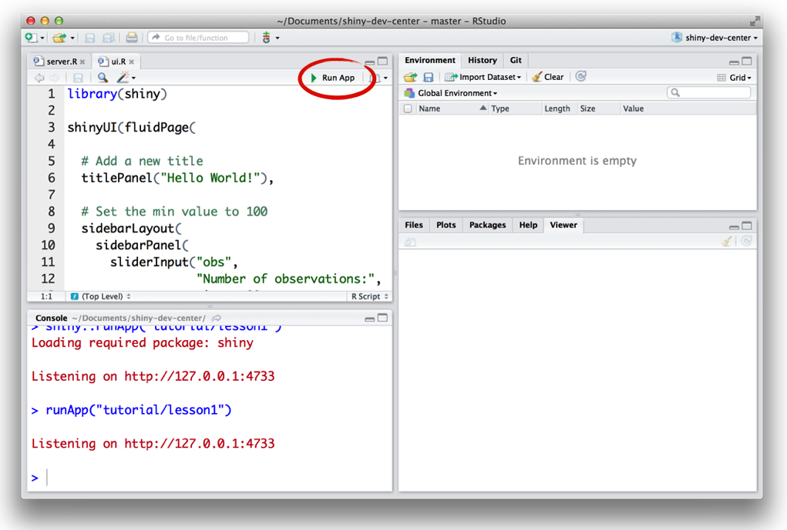
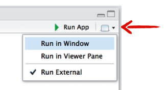
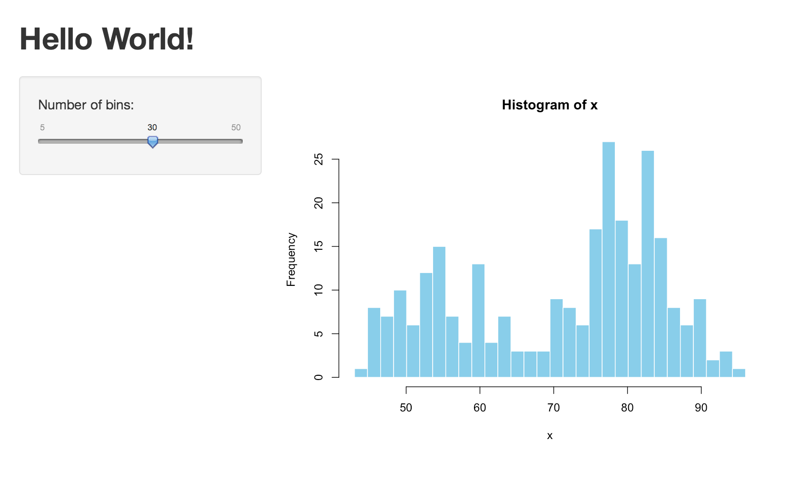
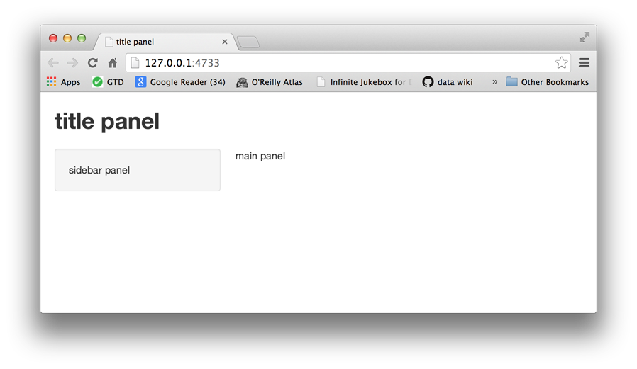
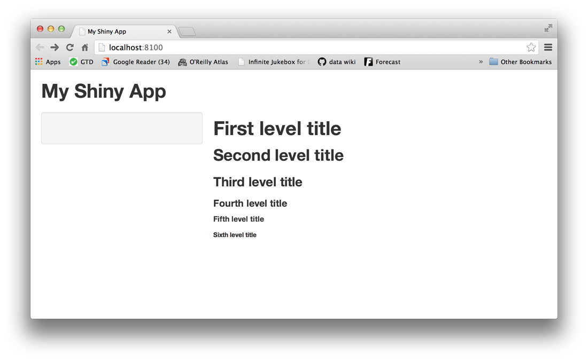
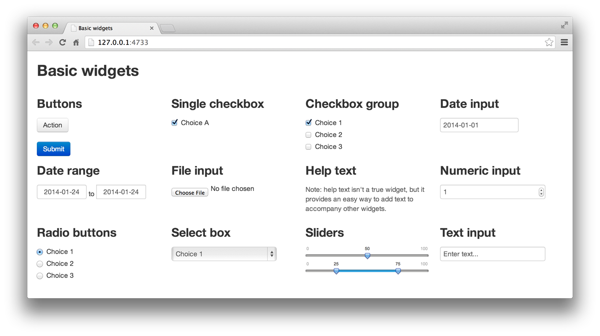

```{r setup, echo=FALSE}
library(shiny)
library(knitr)
opts_chunk$set(eval=FALSE, out.width=".5\\textwidth", fig.align="center")
```

# Getting to know Shiny

Shiny is an R package that makes it easy to build interactive web applications (apps) straight from R. The Shiny package comes with eleven built-in examples that each demonstrate how Shiny works. Each example is a self-contained Shiny app.

The **Hello Shiny** example plots a histogram of R’s `faithful` dataset with a configurable number of bins. Users can change the number of bins with a slider bar, and the app will immediately respond to their input. You’ll use **Hello Shiny** to explore the structure of a Shiny app and to create your first app. 

To run **Hello Shiny**, type:

```{r runExample}
library(shiny)
runExample("01_hello")
```

## Structure of a Shiny App

Shiny apps have two components:

- a user-interface script
- a server script

The user-interface (ui) script controls the layout and appearance of your app. It is defined in a source script named `ui.R`. Below is the `ui.R` script for the **Hello Shiny** example.

```{r ui}
library(shiny)

# Define UI for application that draws a histogram
shinyUI(fluidPage(

  # Application title
  titlePanel("Hello Shiny!"),

  # Sidebar with a slider input for the number of bins
  sidebarLayout(
    sidebarPanel(
      sliderInput("bins",
                  "Number of bins:",
                  min = 1,
                  max = 50,
                  value = 30)
    ),

    # Show a plot of the generated distribution
    mainPanel(
      plotOutput("distPlot")
    )
  )
))
```

The `server.R` script contains the instructions that your computer needs to build your app. Here is the `server.R` script for the **Hello Shiny** example.

```{r}
library(shiny)

# Define server logic required to draw a histogram
shinyServer(function(input, output) {

  # Expression that generates a histogram. The expression is
  # wrapped in a call to renderPlot to indicate that:
  #
  #  1) It is "reactive" and therefore should re-execute automatically
  #     when inputs change
  #  2) Its output type is a plot

  output$distPlot <- renderPlot({
    x    <- faithful[, 2]  # Old Faithful Geyser data
    bins <- seq(min(x), max(x), length.out = input$bins + 1)

    # draw the histogram with the specified number of bins
    hist(x, breaks = bins, col = 'darkgray', border = 'white')
  })
})
```

At one level, the **Hello Shiny** `server.R` script is very simple. The script does some calculations and then plots a histogram with the requested number of bins.

However, you’ll also notice that most of the script is wrapped in a call to `renderPlot`. The comment above the function explains a bit about this, but if you find it confusing, don’t worry. We’ll cover this concept in much more detail soon.

Play with the **Hello Shiny** app and review the source code. Try to develop a feel for how the app works.

Your R session will be busy while the **Hello Shiny** app is active, so you will not be able to run any R commands. R is monitoring the app and executing the app’s reactions. To get your R session back, hit escape or click the stop sign icon (found in the upper right corner of the RStudio console panel).

## Running an App

Every Shiny app has the same structure: two R scripts saved together in a directory. At a minimum, a Shiny app has `ui.R` and `server.R` files.

You can create a Shiny app by making a new directory and saving a `ui.R` and `server.R` file inside it. Each app will need its own unique directory.

You can run a Shiny app by giving the name of its directory to the function `runApp`. For example, if your Shiny app is in a directory called `my_app`, run it with the following code:

```{r runApp}
library(shiny)
runApp("my_app")
```

Note: The first argument of `runApp` is the filepath from your working directory to the app’s directory. The code above assumes that the app directory is in your working directory. In this case, the filepath is just the name of the directory.

In case you are wondering, the **Hello Shiny** app’s files are saved in a special system directory designed to work with the `runExample` call. Alternatively, you can also launch the app using

```{r system.file}
runApp(system.file(package="shiny", "examples", "01_hello"))
```

## Your turn

Create your first Shiny app named `MyApp`. For this, start RStudio and from the **File** menu choose *New Project... > New Directory > Shiny Web Application*. As the directory name enter the desired name `MyApp`. The project will start with `ui.R` and `server.R` containing the familar code from the **Hello Shiny** app. 

To launch your app execute `runApp("MyApp")` in your R console. Alternatively, you can click the Run App button (at the top of the editor), or or use the keyboard shortcut: `Command+Shift+Enter` on MAC, or `Control+Shift+Enter` on Windows.



RStudio will launch the app in a new window by default, but you can also choose to have the app launch in a dedicated viewer pane, or in your external web browser. Make your selection by clicking the icon next to Run App.



Now make some changes to your app:

1. Change the title from “Hello Shiny!” to “Hello World!”.
2. Set the minimum value of the slider bar to 5.
3. Change the histogram color from `"darkgray"` to `"skyblue"`.

When you are ready, launch your app again. Your new app should match the image below. 




# Building a user interface

Now that you understand the structure of a Shiny app, it’s time to build your first app from scratch.
We will start by showing how to build a user interface for your app. You will learn how to lay out the user interface and add HTML elements to your Shiny app.

We’ll use the `MyApp` you made before. To get started, open its server.R and ui.R files, and edit the scripts to match the ones below:

**ui.R**

```{r}
shinyUI(fluidPage(
))
```

**server.R**
```{r}
shinyServer(function(input, output) {
})
```

This code is the bare minimum needed to create a Shiny app. The result is an empty app with a blank user interface.

## Layout

Shiny `ui.R` scripts use the function `fluidPage` to create a display that automatically adjusts to the dimensions of your user’s browser window. You lay out your app by placing elements in the `fluidPage` function.

For example, the `ui.R` script below creates a user-interface that has a title panel and then a sidebar layout, which includes a sidebar panel and a main panel. Note that these elements are placed within the fluidPage function.

```{r}
# ui.R

shinyUI(fluidPage(
  titlePanel("title panel"),

  sidebarLayout(
    sidebarPanel( "sidebar panel"),
    mainPanel("main panel")
  )
))
```



`titlePanel` and `sidebarLayout` are the two most popular elements to add to `fluidPage`. They create a basic Shiny app with a sidebar. `sidebarLayout` always takes two arguments:

- sidebarPanel function output
- mainPanel function output

These functions place content in either the sidebar or the main panels. 

`titlePanel` and `sidebarLayout` create a basic layout for your Shiny app, but you can also create more advanced layouts. For example, `navbarPage` creates a multi-page user-interface that includes a navigation bar. You can also divide the page into equally spaced regions using `flowLayout` and `inputPanel`, or you can use `fluidRow` and `column` to build your layout up from a grid system. For an overview, see the *Shiny cheat sheet*.

## HTML Content

You can add content to your Shiny app by placing it inside a `*Panel` function. For example, the apps above display a character string in each of their panels. The words “sidebar panel” appear in the sidebar panel, because we added the string to the `sidebarPanel` function, i.e. `sidebarPanel("sidebar panel")`. The same is true for the text in the title panel and the main panel.

To add more advanced content, use one of Shiny’s HTML tag functions. These functions parallel common HTML5 tags. As an example, let’s try out creating headers.

### Headers

To create a header element:

- select a header function (e.g., `h1` or `h3`)

- give it the text you want to see in the header

For example, you can create a first level header that says “My title” with `h1("My title")`. If you run the command at the command line, you’ll notice that it produces HTML code.

```{r h1}
h1("My title")
```

    ## <h1>My title</h1>

To place the element in your app, pass `h1("My title")` as an argument to `titlePanel`, `sidebarPanel`, `or mainPanel`.

The text will appear in the corresponding panel of your web page. You can place multiple elements in the same panel if you separate them with a comma.

Give this a try. The new script below uses all six levels of headers. Update your `ui.R` to match the following script and then relaunch your app.

```{r}
# ui.R

shinyUI(fluidPage(
  titlePanel("My Shiny App"),
  sidebarLayout(
    sidebarPanel(),
    mainPanel(
      h1("First level title"),
      h2("Second level title"),
      h3("Third level title"),
      h4("Fourth level title"),
      h5("Fifth level title"),
      h6("Sixth level title")
    )
  )
))
```

Now your app should look like this:



## Other tags

We have demonstrated how to use the header tag functions, but there are many more tag functions for you to use. `shiny::tags` contains a list of 110 functions, where each function builds a specific HTML tag. If you are familiar with HTML, you will recognize these tags by their names.

```{r tags, eval=TRUE}
names(tags)
```

To create a tag, run an element of `tags` as a function. For instance, to create a `div` tag, use:

```{r div, eval=TRUE}
tags$div()
```

    ##<div></div>
    
You can call some of the most popular tags with helper functions that makes accessing them easier. For example, the `code` function is a wrapper for `tags$code` and creates text formatted as computer code. Other available helper functions are: `a`, `br`, `code`, `div`, `em`, `h1`, `h2`, `h3`, `h4`, `h5`, `h6`, `hr`, `img`, `p`, `pre`, `span`, and `strong`. The names of other tags functions conflict with the names of native R functions, so you will need to call them with the `tags$` syntax.

# Control widgets 

Now that you know how to create the layout of the user interface, it's time to add control widgets to your Shiny app. A widget is a web element that users can interact with. Widgets provide a way to send messages to the Shiny app.

Shiny widgets collect a value from the user. When the user changes the widget, the value will change as well.

Shiny comes with a family of pre-built widgets, each created with a transparently named R function. For example, Shiny provides a function namessliderInput that creates a slider bar.

The standard Shiny widgets are:

function | widget
---------|-------
`actionButton` | Action Button
`checkboxGroupInput` | A group of check boxes
`checkboxInput` |	A single check box
`dateInput` | A calendar to aid date selection
`dateRangeInput` | A pair of calendars for selecting a date range
`fileInput` |	A file upload control wizard
`helpText` | Help text that can be added to an input form
`numericInput` | A field to enter numbers
`radioButtons` | A set of radio buttons
`selectInput` | A box with choices to select from
`sliderInput` | A slider bar
`submitButton` | A submit button
`textInput` | A field to enter text



Some of these widgets are built using the Twitter Bootstrap project, a popular open source framework for building user interfaces.

## Adding widgets

You can add widgets to your web page in the same way that you added other types of HTML content by placing a widget function in `sidebarPanel` or `mainPanel` in your `ui.R` file.

Each widget function requires several arguments. The first two arguments for each widget are

- A Name for the widget. The user will not see this name, but you can use it to access the widget’s value. The name should be a character string.
- A label. This label will appear with the widget in your app. It should be a character string, but it can be an empty string `""`.

In this example, the name is “action” and the label is “Action”: `actionButton("action", label = "Action")`

The remaining arguments vary from widget to widget, depending on what the widget needs to do its job, like initial values, ranges, and increments. You can find the exact arguments needed by a widget on the widget function’s help page, e.g., `?selectInput`.

The code below makes the app pictured above. Change the `ui.R` script of `MyApp` to match it, and then relaunch the app.

Play with each widget to get a feel for what it does. Experiment with changing the values of the widget functions and observe the effects.

```{r}
# ui.R

shinyUI(fluidPage(
  titlePanel("Basic widgets"),
  
  fluidRow(
    
    column(3,
      h3("Buttons"),
      actionButton("action", label = "Action"),
      br(),
      br(), 
      submitButton("Submit")),
    
    column(3,
      h3("Single checkbox"),
      checkboxInput("checkbox", label = "Choice A", value = TRUE)),
    
    column(3, 
      checkboxGroupInput("checkGroup", 
        label = h3("Checkbox group"), 
        choices = list("Choice 1" = 1, 
           "Choice 2" = 2, "Choice 3" = 3),
        selected = 1)),
    
    column(3, 
      dateInput("date", 
        label = h3("Date input"), 
        value = "2014-01-01"))   
  ),
  
  fluidRow(
    
    column(3,
      dateRangeInput("dates", label = h3("Date range"))),
    
    column(3,
      fileInput("file", label = h3("File input"))),
    
    column(3, 
      h3("Help text"),
      helpText("Note: help text isn't a true widget,", 
        "but it provides an easy way to add text to",
        "accompany other widgets.")),
    
    column(3, 
      numericInput("num", 
        label = h3("Numeric input"), 
        value = 1))   
  ),
    
  fluidRow(
    
    column(3,
      radioButtons("radio", label = h3("Radio buttons"),
        choices = list("Choice 1" = 1, "Choice 2" = 2,
                       "Choice 3" = 3),selected = 1)),
    
    column(3,
      selectInput("select", label = h3("Select box"), 
        choices = list("Choice 1" = 1, "Choice 2" = 2,
                       "Choice 3" = 3), selected = 1)),
    
    column(3, 
      sliderInput("slider1", label = h3("Sliders"),
        min = 0, max = 100, value = 50),
      sliderInput("slider2", "",
        min = 0, max = 100, value = c(25, 75))
      ),
    
    column(3, 
      textInput("text", label = h3("Text input"), 
        value = "Enter text..."))   
  )

))
```

<!--
# Use R scripts and data

We will now show you how to load other scripts and packages to use in your Shiny apps. Our ultimate goal will be building an interactive MA plot explorer. 
-->

# Interactive MA plot explorer

You will now build a new Shiny app that creates an interactive MA plot. The app will allow you to select a gene by clicking on the MA plot, and will display a counts plot of the selected gene.

This new Shiny app will need its own, new directory. Create a folder in your working directory named `plotMA`. This is where we’ll save the `ui.R` and `server.R` files described below.

```{r, eval=TRUE, echo=FALSE}
opts_chunk$set(eval=TRUE)
```

We will continue with the example from the RNA-seq tutorial. The results of differential expression calling have been saved to the data file `data.rda`. Let's start by loading the data and reproducing the MA plot.

```{r, eval=TRUE, fig.width=5, fig.height=5, message=FALSE}
library(DESeq2)

load("data.rda")
res <- results(dds)

ymax <- 5
plotMA( res, ylim=c( -ymax, ymax ) )
```

```{r, eval=TRUE, echo=FALSE}
opts_chunk$set(eval=FALSE)
```

## Displaying R output in Shiny

For the MA plot to appear in our Shiny app, we need to:

- Add the plot to the user interface definition in `ui.R`.
- Tell Shiny how to render the plot in `server.R`.

### Step 1: Add an R object to the UI

Shiny provides a family of functions that turn R objects into output for your user interface. Each function creates a specific type of output. 

Output function | creates
--- | ---
`htmlOutput` | raw HTML
`imageOutput` | image
`plotOutput` | plot
`tableOutput` |	table
`textOutput` | text
`uiOutput` | raw HTML

You can add these output functions to the user-interface in the same way that you added HTML elements and widgets. 

Let's start by adding the MA plot to the user interface using `plotOutput`.

```r
# ui.R

size = 500

shinyUI(fluidPage(
  titlePanel("MA plot explorer"),

  splitLayout(cellWidths=size,
    plotOutput("plotma", width=size, height=size)
  )
  
))

```

Notice that `plotOutput` takes as its first argument the character string `"plotma"`. Each of the `*Output` functions requires a single argument: a character string that Shiny will use as the name of your reactive element. Your users will not see this name, but you will use it later.

We have used `fluidPage` again, but this time we use `splitLayout` to organize the content into cells of width specified by `cellWidths`. We set the width of the cells and the width and height of the plot to the same value given by `size`, which we have set to 500 pixels.

### Step 2: Provide R code to build the plot

Placing a function in `ui.R` tells Shiny where to display your object. Next, you need to tell Shiny how to build the object.

Do this by providing R code that builds the object in `server.R`. The code should go in the unnamed function that appears inside `shinyServer` in your `server.R` script.

The unnamed function plays a special role in the Shiny process; it builds a list-like object named output that contains all of the code needed to update the R objects in your app. Each R object needs to have its own entry in the list.

You can create an entry by defining a new element for output within the unnamed function, like below. The element name should match the name of the reactive element that you created in `ui.R`.

In the script below, `output$plotma` matches `plotOutput("plotma", width=size, height=size)` in your `ui.R` script.

```r
# server.R

library(DESeq2)

load("data.rda")
res <- results(dds)

ymax = 5

shinyServer(function(input, output) {
  
  # MA-plot
  output$plotma <- renderPlot({
    par(mar=c(5,5,3,2), cex.lab=2, cex.main=2, cex.axis=1.5)
    # MA-plot of all genes
    plotMA(res, ylim=c( -ymax, ymax ))
  })
  
})
```

Notice that we have included the code for loading and preprocessing the data just before the call to `shinyServer`. In order that your app finds the data, you need to copy the `data.rda` file to your app's directory. 

The call to `par` before `plotMA` sets some graphical parameters improving some aesthetics of the figure, like `mar` setting the margins, or `cex.*` increasing the text size of the corresponding elements. For more details see `?par`.

Each entry to output should contain the output of one of Shiny’s `render*` functions. These functions capture an R expression and do some light pre-processing on the expression. Use the `render*` function that corresponds to the type of reactive object you are making.

Render function | creates
--- | ---
`renderImage` | images (saved as a link to a source file)
`renderPlot` | plots
`renderPrint` | any printed output
`renderTable` | data frame, matrix, other table like structures
`renderText` |	character strings
`renderUI` |	a Shiny tag object or HTML

Each `render*` function takes a single argument: an R expression surrounded by braces, `{}`. The expression can be one simple line of text, or it can involve many lines of code, as if it were a complicated function call.

Think of this R expression as a set of instructions that you give Shiny to store for later. Shiny will run the instructions when you first launch your app, and then Shiny will re-run the instructions every time it needs to update your object.

For this to work, your expression should return the object you have in mind (a piece of text, a plot, a data frame, etc). You will get an error if the expression does not return an object, or if it returns the wrong type of object.

## Reactive output using widget values

At this stage, if you run your app, it will just display a static MA plot. We will now extend it by adding a slider widget controlling the significance level for thresholding adjusted p-values. 

First, lets add a slider widget below our plot output:

```r
# ui.R

size = 500

shinyUI(fluidPage(
  titlePanel("MA plot explorer"),

  splitLayout(cellWidths=size,
    plotOutput("plotma", width=size, height=size)
  ),
  splitLayout(cellWidths=size,
    sliderInput("alpha", "Adjusted p-value threshold",
                min=0, max=0.2, value=0.1, step=0.01, width=size)
  )
  
))
```

You can make the plot reactive by asking Shiny to call the slider value when it builds the plot. Let’s look at how to do this.

Take a look at the first line of code in `server.R`. Do you notice that the unnamed function mentions *two* arguments, `input` and `output`? You already saw that `output` is a list-like object that stores instructions for building the R objects in your app.

`input` is a second list-like object. It stores the current values of all of the widgets in your app. These values will be saved under the names that you gave the widgets in `ui.R`.

So for example, our app has one widget named `"alpha"`, whose value will be saved in `input` as `input$alpha`. Shiny will automatically make an object reactive if the object uses an `input` value. In order to use the user-controlled value `input$alpha` to create a reactive MA plot, substitute in your `server.R` script the line containing the call to `plotMA` by the following one:

```r
plotMA(res, ylim=c( -ymax, ymax ), alpha=input$alpha)
```

When you are ready updating your `ui.R` and `server.R` files, launch your Shiny app. You plot should redraw instantly as you move the slider.

Shiny tracks which outputs depend on which widgets. When a user changes a widget, Shiny will rebuild all of the outputs that depend on the widget, using the new value of the widget as it goes. As a result, the rebuilt objects will be completely up-to-date.

This is how you create reactivity with Shiny, by connecting the values of `input` to the objects in `output`. Shiny takes care of all of the other details.

## Reactivity

Finally, we will make the MA plot clickable allowing to select a gene, and add the counts plot for the selected gene. 

We start by adding to the interface layout the `plotOutput` function for the counts plot, so that the `ui.R` script matches the following:

```{r}
# ui.R

size = 500

shinyUI(fluidPage(
  titlePanel("MA plot explorer"),

  splitLayout(cellWidths=size,
    plotOutput("plotma", click="plotma_click", width=size, height=size),
    plotOutput("plotcounts", width=size, height=size)
  ),
  splitLayout(cellWidths=size,
    sliderInput("alpha", "Alpha", min=0, max=0.2, value=0.1, step=0.01, width=size)
  )
  
))
```

Notice the additional `click` argument to the `plotOutput` function of the MA plot. If set to a value like `plotma_click`, the plot will send coordinates to the server whenever it is clicked. This value will be accessible via `input$plotma_click` and will contain a named list with `x` and `y` elements indicating the mouse position. We will use the `input$plotma_click` coordinates to resolve the nearest gene in the MA plot.

Let's get back to our `server.R` script. In order to be able to resolve which point in the MA plot was closest to the click we will create the `t.data.scaled` object containing points normalized coordinates.

```r
library(DESeq2)

load("data.rda")
res <- results(dds)

ymax <- 5

# this object will be used to locate points from click events.
data <- with(res, cbind(baseMean, log2FoldChange))
data[,2] <- pmin(ymax, pmax(-ymax, data[,2]))
scale <- c(diff(range(data[,1])), 2*ymax)
t.data.scaled <- t(data)/scale

shinyServer(function(input, output) {
  
  current = reactiveValues(idx = NULL)
  
  xy = reactive(c(input$plotma_click$x, input$plotma_click$y))
  
  observe({
    if (!is.null(xy())) {
      ## find index of the closest point
      sqdists <- colMeans( (t.data.scaled - xy()/scale )^2 ) 
      current$idx <- which.min(sqdists)  
    }
  })
  
  # MA-plot
  output$plotma <- renderPlot({
    par(mar=c(5,5,3,2), cex.lab=2, cex.main=2, cex.axis=1.5)
    # MA-plot of all genes
    plotMA(res, ylim=c( -ymax, ymax ), alpha=input$alpha)
    # add circle for the selected point
    idx = current$idx
    if (!is.null(idx)) points( data[idx,1], data[idx,2], col="dodgerblue", cex=3, lwd=3 )
  })

  # counts plot
  output$plotcounts <- renderPlot({
    par(mar=c(5,5,3,2), cex.lab=2, cex.main=2, cex.axis=1.5)
    # plot the counts for the selected gene
    # update only when idx changes
    idx = current$idx
    if (!is.null(idx)) plotCounts( dds, idx, intgroup=c("dex") )
  })
  
})
```

Apart from the updated `renderPlot` functions responsible for plotting, there are some other important additions to the Shiny app. Namely, we have used a `reactiveValues`, a `reactive` expression, and an `observer` to streamline our app.

### Reactive values

Reactive values contain values which can change over time, and which can be read by other reactive objects. For istance, the `input` object is a `reactiveValues` object, which looks something like a list, and it contains many individual reactive values.

When you read a value from a `reactiveValues` object, the calling reactive expression takes a reactive dependency on that value, and when you write to it, it notifies any reactive functions that depend on that value.

We define our the reactive value `current$idx` to hold the index of the currently highlighted gene. It's value is set in the `observer` described below, and both plots depend on it.

### Reactive expressions

Conceptually, a reactive expression is an R expression whose result will change over time. They can read reactive values, e.g. widget inputs, and call other reactive expressions. The reactive expression will update its value whenever the original widget changes.

To create a reactive expression use the `reactive` function, which takes an R expression, just like the `render*` functions.

In our example we create an `xy` reactive expression containg the click coordinates.

```r
xy = reactive(c(input$plotma_click$x, input$plotma_click$y))
```

The above expression returns a vector of two numbers. You can use it to access the click coordinates in other parts of your app by calling `xy()`. For example, we use it the observer to resolve the gene closest to the click.

```r
observe({
  if (!is.null(xy())) {
    ## find index of the closest point
    sqdists <- colMeans( (t.data.scaled - xy()/scale )^2 ) 
    current$idx <- which.min(sqdists)  
  }
})
```

Reactive expressions are a bit smarter than regular R functions. They cache their values and know when their values have become outdated. What does this mean? The first time that you run a reactive expression, the expression will save its result in your computer’s memory. The next time you call the reactive expression, it can return this saved result without doing any computation (which will make your app faster).

The reactive expression will only return the saved result if it knows that the result is up-to-date. If the reactive expression has learned that the result is obsolete (because a widget has changed), the expression will recalculate the result. It then returns the new result and saves a new copy. The reactive expression will use this new copy until it too becomes out of date.

### Observers

Observers are similar to reactive expressions, but with a few important differences. Like reactive expressions, they can access reactive values and reactive expressions. However, they do not return any values, and therefore are only useful for their side effects. 

The observer above is used to update the `current$idx` value only when the value of `xy()` changes to a non-null value, which corresponds to the user clicking the plot.

## Dependencies

What happens if you click on the MA plot?

This will make both plots drawn by `renderPlot` out of date, even though they don't depend directly on neither `input$plotma_click`, nor `xy()`. Shiny will know that they became outdated and will redraw the plots because it keeps track of which reactive expressions or values an output object depends on. Shiny will automatically re-build an object if

- an reactive/input value in the objects’s `render*` function changes, or
- a reactive expression in the objects’s `render*` function becomes obsolete.

Think of reactive expressions as links in a chain that connect input values to output objects. The objects in output will respond to changes made anywhere downstream in the chain. (You can fashion a long chain because reactive expressions can call other reactive expressions).


