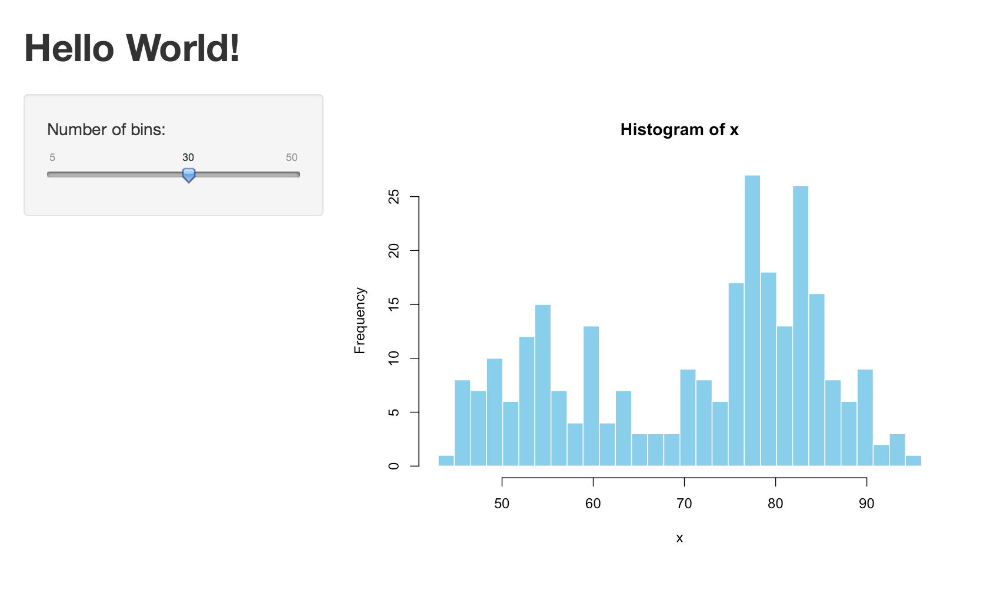

# Getting to know Shiny

`r CRANpkg("shiny")` is an R package that makes it easy to build interactive web applications (apps) straight from R. The package comes with eleven built-in examples that each demonstrate how Shiny works. Each of these examples is a self-contained app.

The **Hello Shiny** example plots a histogram of R’s `faithful` dataset with a configurable number of bins. Users can change the number of bins with a slider bar, and the app will immediately respond to their input. You’ll use **Hello Shiny** to explore the structure of a Shiny app and to create your first app. 

```{r setup, echo=FALSE}
library(shiny)
library(knitr)
opts_chunk$set(eval=FALSE, out.width=".5\\textwidth", fig.align="center")
```

To run **Hello Shiny**, type:

```{r runExample}
library(shiny)
runExample("01_hello")
```

## Structure of a Shiny App

Shiny apps have two components:

- a user interface script
- a server script

The user interface (UI) script controls the layout and appearance of your app. It is defined in a source file named `ui.R`. Below is the `ui.R` script for the **Hello Shiny** example.

```{r ui}
library(shiny)

# Define UI for application that draws a histogram
shinyUI(fluidPage(

  # Application title
  titlePanel("Hello Shiny!"),

  # Sidebar with a slider input for the number of bins
  sidebarLayout(
    sidebarPanel(
      sliderInput("bins",
                  "Number of bins:",
                  min = 1,
                  max = 50,
                  value = 30)
    ),

    # Show a plot of the generated distribution
    mainPanel(
      plotOutput("distPlot")
    )
  )
))
```

The `server.R` script contains the instructions that your computer needs to build the app. Here is the `server.R` file for the **Hello Shiny** example.

```{r}
library(shiny)

# Define server logic required to draw a histogram
shinyServer(function(input, output) {

  # Expression that generates a histogram. The expression is
  # wrapped in a call to renderPlot to indicate that:
  #
  #  1) It is "reactive" and therefore should be automatically
  #     re-executed when inputs change
  #  2) Its output type is a plot

  output$distPlot <- renderPlot({
    x    <- faithful[, 2]  # Old Faithful Geyser data
    bins <- seq(min(x), max(x), length.out = input$bins + 1)

    # draw the histogram with the specified number of bins
    hist(x, breaks = bins, col = 'darkgray', border = 'white')
  })

})
```

At one level, the **Hello Shiny** server script is very simple. It does some calculations and then plots a histogram with the requested number of bins.

However, you’ll also notice that most of the script is wrapped in a call to `renderPlot`. The comment above the function explains a bit about this, but if you find it confusing, don’t worry. We’ll cover this concept in much more detail soon.

Play with the **Hello Shiny** app and review it's source code. Try to develop a feel for how the app works.

Your R session will be busy while the **Hello Shiny** app is active, so you will not be able to run any R commands. R is monitoring the app and executing the app’s reactions. To get your R session back, hit escape or click the stop sign icon (found in the upper right corner of the RStudio console panel).

## Running an App

Every Shiny app has the same structure: two R scripts saved together in a directory. At a minimum, an app has `ui.R` and `server.R` files, and you can create an app by making a new directory and saving the `ui.R` and `server.R` file inside it. Each Shiny app will need its own unique directory.

You can run a Shiny app by giving the name of its directory to the function `runApp`. For example, if your app is in a directory called `my_app`, run it with the following code:

```{r runApp}
library(shiny)
runApp("my_app")
```

Note: The first argument of `runApp` is the file path from your working directory to the app’s directory. The code above assumes that the app directory is in your working directory; in such case, the file path is just the name of the directory.

In case you are wondering, the **Hello Shiny** app’s files are stored in a special system directory designed to work with the `runExample` call. Alternatively, you can also launch that app by calling

```{r system.file}
runApp(system.file(package="shiny", "examples", "01_hello"))
```

## Your turn

Create your first Shiny app named `my_app`. For this, start RStudio and from the **File** menu choose *New Project... > New Directory > Shiny Web Application*. As the *Directory name* enter the desired name **my_app**. The project will start with `ui.R` and `server.R` containing the familiar code from the **Hello Shiny** app. 

To launch your app execute `runApp()` in your R console. Alternatively, you can click the Run App button (at the top of the editor), or or use the keyboard shortcut: `Control+Shift+Enter` on Windows/Linux, or `Command+Shift+Enter` on MAC.


RStudio will launch the app in a new window by default, but you can also choose to have the app launch in a dedicated viewer pane, or in your external web browser. Make your selection by clicking the icon next to Run App.


Now make some changes to your app:

1. Change the title to “Hello World!”.
2. Set the minimum value of the slider bar to 5.
3. Change the histogram color from `"darkgray"` to `"skyblue"`.

When you are ready, launch your app again. Your new app should match the image below. 




# Building a user interface

Now that you understand the structure of a Shiny app, it’s time to build your first app from scratch. We will start by showing how to build a user interface. You will learn how to lay out the user interface and add HTML elements to it.

We’ll use the `my_app` you made before. To get started edit the `server.R` and `ui.R` files to match the scripts below:

**ui.R**
```{r}
shinyUI(fluidPage())
```

**server.R**
```{r}
shinyServer(function(input, output) {})
```

This code is the bare minimum needed to create a Shiny app. The result is an empty app with a blank user interface.

## Layout

The Shiny `ui.R` script uses the function `fluidPage` to create a display that automatically adjusts to the dimensions of your user’s browser window. You lay out the app by placing elements in the `fluidPage` function.

For example, the `ui.R` script below creates a user interface that has a title panel and then a sidebar layout, which includes a sidebar panel and a main panel. Note that these elements are placed within the `fluidPage` function.

```{r}
# ui.R

shinyUI(fluidPage(
  titlePanel("title panel"),

  sidebarLayout(
    sidebarPanel("sidebar panel"),
    mainPanel("main panel")
  )
))
```


`titlePanel` and `sidebarLayout` are the two most popular elements to add to `fluidPage`. They create a basic Shiny app with a sidebar. `sidebarLayout` always takes two arguments:

- sidebarPanel function output
- mainPanel function output

These functions place content in either the sidebar or the main panels. 

`titlePanel` and `sidebarLayout` create a basic layout for your Shiny app, but you can also create more advanced designs. For example, `navbarPage` creates a multi-page user interface that includes a navigation bar. You can also divide the page into equally spaced regions using `splitLayout`, or you can use `fluidRow` and `column` to build a grid-based layout. For an overview, see the *Shiny cheat sheet*.

## HTML Content

You can add content to your Shiny app by placing it inside a `*Panel` function. For example, the app above displays a character string in each of its panels. The words “sidebar panel” appear in the sidebar panel, because we added the string to the `sidebarPanel` function, i.e. `sidebarPanel("sidebar panel")`. The same is true for the text in the title panel and the main panel.

To add more advanced content, use one of Shiny’s HTML tag functions. These functions parallel common HTML5 tags. As an example, let’s try out creating headers.

### Headers

To create a header:

- select a header function (e.g., `h1` or `h3`)

- give it the text you want to appear in the header

For example, you can create a first level header that says “My title” with `h1("My title")`. If you run this command in R, you’ll notice that it produces HTML code.

```{r h1}
h1("My title")
```

    ## <h1>My title</h1>

To place the element in your app, pass `h1("My title")` as an argument to `titlePanel`, `sidebarPanel`, or `mainPanel`.

The text will appear in the corresponding panel of your web page. You can place multiple elements in the same panel if you separate them with a comma.

Give this a try. The script below uses all six levels of headers. Update your `ui.R` file to match the following code and then relaunch your app.

```{r}
# ui.R

shinyUI(fluidPage(
  titlePanel("My Shiny App"),
  sidebarLayout(
    sidebarPanel(),
    mainPanel(
      h1("First level title"),
      h2("Second level title"),
      h3("Third level title"),
      h4("Fourth level title"),
      h5("Fifth level title"),
      h6("Sixth level title")
    )
  )
))
```

Now your app should look like this:


## Other tags

We have demonstrated how to use the header tag functions, but there are many more tag functions for you to use. `shiny::tags` contains a list of 110 functions, each of which builds a specific HTML tag. If you are familiar with HTML, you will recognize these tags by their names.

```{r tags, eval=TRUE}
names(tags)
```

To create a tag, run an element of `tags` as a function. For instance, to create a `div` tag, use:

```{r div, eval=TRUE}
tags$div()
```

    ##<div></div>
    
You can call some of the most popular tags with helper functions that make accessing them easier. For example, the function `code` is a wrapper for `tags$code` and creates text formatted as computer code. Other available helper functions are: `a`, `br`, `code`, `div`, `em`, `h1`, `h2`, `h3`, `h4`, `h5`, `h6`, `hr`, `img`, `p`, `pre`, `span`, and `strong`. The names of the rest of tag functions conflict with the names of native R functions, so you will need to call them with the `tags$` syntax.

# Control widgets 

Now that you know how to create the layout of the user interface, it's time to add some control widgets to your app. A widget is a web element that users can interact with. Widgets provide a way to collect values from the user and send them to your app. When the user changes the widget, the value will change as well.

Shiny comes with a family of pre-built widgets, each created with a transparently named R function. For example, the function `sliderInput` creates a slider bar. The standard Shiny widgets are:

function | widget
---------|-------
`actionButton` | Action Button
`checkboxGroupInput` | A group of check boxes
`checkboxInput` |	A single check box
`dateInput` | A calendar to aid date selection
`dateRangeInput` | A pair of calendars for selecting a date range
`fileInput` |	A file upload control wizard
`helpText` | Help text that can be added to an input form
`numericInput` | A field to enter numbers
`radioButtons` | A set of radio buttons
`selectInput` | A box with choices to select from
`sliderInput` | A slider bar
`submitButton` | A submit button
`textInput` | A field to enter text


Some of these widgets are built using the Twitter Bootstrap project, a popular open source framework for building user interfaces.

## Adding widgets

You can add widgets to the user interface in the same way that you added other types of HTML content by placing a widget function in `sidebarPanel` or `mainPanel` in your `ui.R` file.

Each widget function requires several arguments. The first two arguments for each widget are

- A Name for the widget. The user will not see this name, but you can use it to access the widget’s value. The name should be a character string.
- A label. This label will appear with the widget in your app. It should be a character string, but it can be an empty string `""`.

In this example, the name is “action” and the label is “Action”: `actionButton("action", label = "Action")`.

The remaining arguments vary from widget to widget, depending on what the widget needs to do its job. You can find the exact arguments required by a widget on the widget function’s help page, e.g., `?selectInput`.

The code below makes the app pictured above. Change the `ui.R` script of `my_app` to match it, and then relaunch the app. Play with each widget to get a feel for what it does. Experiment with changing the values of the widget functions and observe the effects.

```{r}
# ui.R

shinyUI(fluidPage(
  titlePanel("Basic widgets"),
  
  fluidRow(
    
    column(3,
      h3("Buttons"),
      actionButton("action", label = "Action"),
      br(),
      br(), 
      submitButton("Submit")),
    
    column(3,
      h3("Single checkbox"),
      checkboxInput("checkbox", label = "Choice A", value = TRUE)),
    
    column(3, 
      checkboxGroupInput("checkGroup", 
        label = h3("Checkbox group"), 
        choices = list("Choice 1" = 1, "Choice 2" = 2, "Choice 3" = 3),
        selected = 1)),
    
    column(3, 
      dateInput("date", label = h3("Date input"), value = "2014-01-01"))   
  ),
  
  fluidRow(
    
    column(3,
      dateRangeInput("dates", label = h3("Date range"))),
    
    column(3,
      fileInput("file", label = h3("File input"))),
    
    column(3, 
      h3("Help text"),
      helpText("Note: help text isn't a true widget,", 
        "but it provides an easy way to add text to",
        "accompany other widgets.")),
    
    column(3, 
      numericInput("num", label = h3("Numeric input"), value = 1))   
  ),
    
  fluidRow(
    
    column(3,
      radioButtons("radio", label = h3("Radio buttons"),
        choices = list("Choice 1" = 1, "Choice 2" = 2, "Choice 3" = 3), selected = 1)),
    
    column(3,
      selectInput("select", label = h3("Select box"), 
        choices = list("Choice 1" = 1, "Choice 2" = 2, "Choice 3" = 3), selected = 1)),
    
    column(3, 
      sliderInput("slider1", label = h3("Sliders"), min = 0, max = 100, value = 50),
      sliderInput("slider2", "", min = 0, max = 100, value = c(25, 75))
      ),
    
    column(3, 
      textInput("text", label = h3("Text input"), value = "Enter text..."))   
  )

))
```

# MA plot explorer

You will now build a new Shiny app that creates an interactive MA plot. The app will allow you to select a gene by clicking on the MA plot, and it will display a counts plot for the selected gene.

This new Shiny app will need its own, new directory: create one in your working directory and name it `ma_plot`. This is where we’ll save the `ui.R` and `server.R` files described below.

The app will use the example data from the RNA-seq tutorial. The results of differential expression calling have been saved to the data file `data.rda`. Let's start by loading it and reproducing the MA plot.

```{r, eval=TRUE, fig.width=5, fig.height=5, message=FALSE}
library(DESeq2)

load("data.rda")
res <- results(dds)

ymax <- 5
plotMA( res, ylim=c(-ymax, ymax) )
```

## Displaying R output in Shiny

For the MA plot to appear in our Shiny app, we need to:

- Add the plot to the user interface definition in `ui.R`.
- Tell Shiny how to render the plot in `server.R`.

### Step 1: Add the plot to the UI

Shiny provides a family of functions that turn R objects into output for your user interface. Each function creates a specific type of output. 

Output function | creates
--- | ---
`htmlOutput` | raw HTML
`imageOutput` | image
`plotOutput` | plot
`tableOutput` |	table
`textOutput` | text
`uiOutput` | raw HTML

You can add these output functions to the user-interface in the same way that you added HTML elements and widgets. Let's use `plotOutput` to add our MA plot to the user interface.

```r
# ui.R

size = 450

shinyUI(fluidPage(
  titlePanel("MA plot explorer"),

  splitLayout(cellWidths=size,
    plotOutput("plotma", width=size, height=size)
  )
  
))

```

Notice that `plotOutput` takes as its first argument the character string `"plotma"`. Each of the `*Output` functions requires a single argument: a character string that Shiny will use as the name of your reactive element. Your users will not see this name, but you will use it later.

We have used `fluidPage` again, but this time we use `splitLayout` to organize the content into cells of width specified by `cellWidths`. We set the width of the cells and the width and height of the plot to the same value given by `size`, which we have set to 450 pixels.

### Step 2: Provide R code to build the plot

Placing a function in `ui.R` tells Shiny where to display your object. Next, you need to tell Shiny how to build the object.

Do this by providing R code that builds the object in `server.R`. The code should go in the unnamed function that appears inside `shinyServer` in the `server.R` script.

The unnamed function plays a special role in the Shiny process; it builds a list-like object named `output` that contains all of the code needed to update the R objects in your app. Each R object needs to have its own entry in the list.

You can create an entry by defining a new element for `output` within the unnamed function, like below. The element name should match the name of the reactive element that you created in `ui.R`. In the script below, `output$plotma` matches `plotOutput("plotma", width=size, height=size)` in your `ui.R` script.

```r
# server.R

library(DESeq2)

load("data.rda")
res <- results(dds)

ymax <- 5

shinyServer(function(input, output) {
  
  # MA-plot
  output$plotma <- renderPlot({
    par( mar=c(5,5,3,2), cex.main=1.5, cex.lab=1.35 )
    plotMA( res, ylim=c(-ymax, ymax), alpha=input$alpha )
  })
  
})
```

Notice that we have included the code for loading and preprocessing the data just before the call to `shinyServer`. In order that your app finds the data, you need to copy the `data.rda` file to your app's directory. 

The call to `par` before `plotMA` sets some graphical parameters improving the aesthetics of the figure, like `mar` setting the margins, or `cex.*` increasing the text size of the corresponding elements. For more details see `?par`.

Each entry to output should contain the output of one of Shiny’s `render*` functions. These functions capture an R expression and do some light preprocessing on it. Use the `render*` function that corresponds to the type of reactive object you are making.

Render function | creates
--- | ---
`renderImage` | images (saved as a link to a source file)
`renderPlot` | plots
`renderPrint` | any printed output
`renderTable` | data frame, matrix, other table like structures
`renderText` |	character strings
`renderUI` |	a Shiny tag object or HTML

Each `render*` function takes a single argument: an R expression surrounded by braces, `{}`. The expression can involve many lines of code, as if it were a complicated function call. Think of this R expression as a set of instructions that you give Shiny to store for later. These instructions will be run when you first launch your app, and they will re-run every time your object needs to be updated.

For this to work, your expression should return the object you have in mind (a piece of text, a plot, a data frame, etc). You will get an error if the expression does not return an object, or if it returns the wrong type of object.

## Reactive output using widget values

At this stage, when you launch your app, it will just display a static MA plot. The function `plotMA` has an argument `alpha` setting the significance level for thresholding adjusted p-values. We will now extend the app by adding a slider widget controlling this parameter.

First, let's add a slider widget below our plot output:

```r
# ui.R

size = 450

shinyUI(fluidPage(
  titlePanel("MA plot explorer"),

  splitLayout(cellWidths=size,
    plotOutput("plotma", click="plotma_click", width=size, height=size),
    plotOutput("plotcounts", width=size, height=size)
  ),
  splitLayout(cellWidths=size,
    sliderInput("alpha", "Adjusted p-value treshold",
                min=0, max=0.2, value=0.1, step=0.001, width=size)
  )
  
))
```

The slider allows to select values in the range from 0 to 0.2 in steps of 0.001, and we have set its width to match the size of the plot above it.

You can make the plot reactive by asking Shiny to call the slider value when it builds the plot. Let’s look at how to do this.

Take a look at the first line of code in `server.R`. Do you notice that the unnamed function mentions *two* arguments, namely `input` and `output`? You already saw that `output` is a list-like object that stores instructions for building the R objects in your app.

`input` is a second list-like object. It stores the current values of all of the widgets in your app. These values will be saved under the widgets' names from `ui.R`.

So for example, our app has one widget named `"alpha"`, whose value will be stored in `input$alpha`. Shiny automatically makes an object reactive if the object uses an `input` value. In order to make the MA plot reactive, substitute in your `server.R` script the line containing the call to `plotMA` by the following one:

```r
plotMA(res, ylim=c(-ymax, ymax), alpha=input$alpha)
```

When you are ready updating the `ui.R` and `server.R` files, launch your Shiny app. The plot should redraw instantly as you move the slider.

Shiny tracks which outputs depend on which widgets. When a user changes a widget, Shiny will rebuild all of the outputs that depend on this widget, using the new value of the widget. As a result, the rebuilt objects will be completely up-to-date.

This is how you create reactivity with Shiny, by connecting the values of `input` to the objects in `output`. Shiny takes care of all of the other details.

## Reactivity

Finally, we will make the MA plot clickable allowing to select a gene, and add the counts plot for the selected gene. 

We start by adding the counts plot next to the MA plot, so that the `ui.R` script matches the following:

```r
# ui.R

size = 450

shinyUI(fluidPage(
  titlePanel("MA plot explorer"),

  splitLayout(cellWidths=size,
    plotOutput("plotma", click="plotma_click", width=size, height=size),
    plotOutput("plotcounts", width=size, height=size)
  ),
  splitLayout(cellWidths=size,
    sliderInput("alpha", "Adjusted p-value treshold",
                min=0, max=0.2, value=0.1, step=0.001, width=size)
  )
  
))
```

Notice the additional `click` argument to the `plotOutput` function of the MA plot. If set to a value like `plotma_click`, the plot will send coordinates to the server whenever it is clicked. This value will be accessible via `input$plotma_click` and will contain a named list with `x` and `y` elements indicating the mouse position. We will use the `input$plotma_click` coordinates to resolve the nearest gene in the MA plot.

Let's get back to our `server.R` script. In order to be able to resolve which point in the MA plot was the closest to the click, we create the `t.data.scaled` object containing points in normalized coordinates. We will use that object to find the closest point in terms of euclidean distance.

```r
# server.R

library(DESeq2)

load("data.rda")
res <- results(dds)

ymax <- 5

# this object will be used to locate points from click events.
data <- with(res, cbind(baseMean, log2FoldChange))
data[,2] <- pmin(ymax, pmax(-ymax, data[,2]))
scale <- c(diff(range(data[,1])), 2*ymax)
t.data.scaled <- t(data)/scale

shinyServer(function(input, output) {
  
  current = reactiveValues(idx = NULL)
  
  observe({
    xy = c(input$plotma_click$x, input$plotma_click$y)
    if (!is.null(xy)) {
      ## find index of the closest point
      sqdists <- colMeans( (t.data.scaled - xy/scale )^2 )
      current$idx <- which.min(sqdists)
    }
  })
  
  # MA-plot
  output$plotma <- renderPlot({
    par( mar=c(5,5,3,2), cex.main=1.5, cex.lab=1.35 )
    plotMA( res, ylim=c(-ymax, ymax), alpha=input$alpha )
    # add a circle around the selected point
    idx = current$idx
    if (!is.null(idx)) points( data[idx,1], data[idx,2], col="dodgerblue", cex=3, lwd=3 )
  })
  
  # counts plot for the selected gene
  output$plotcounts <- renderPlot({
    par( mar=c(5,5,3,2), cex.main=1.5, cex.lab=1.35 )
    # update only when idx changes
    idx = current$idx
    if (!is.null(idx)) plotCounts( dds, idx, intgroup=c("dex") )
  })

})
```

Apart from the updated `renderPlot` functions responsible for plotting, there are some other important additions to our Shiny app. Namely, we have used a `reactiveValues` object and an `observer` to streamline the app.

### Reactive values

Reactive values contain values which can change over time, and which can be read by other reactive objects. In particular, the `input` object is a `reactiveValues` object, which looks something like a list, and contains many individual reactive values.

When you read a value from a `reactiveValues` object, the calling reactive expression takes a reactive dependency on that value, and when you write to it, it notifies any reactive functions that depend on that value.

We use the reactive value `current$idx` for storing the index of the currently highlighted gene. It's value is set in the `observer` described below, and both plots depend on it.

### Observers

Observers can read reactive values, e.g. widget inputs. An observer will update its value whenever the original widget changes. Observers do not return any values, and therefore are only useful for their side effects. 

The observer above is used to update the `current$idx` value only when the value of `c(input$plotma_click$x, input$plotma_click$y)` changes to a non-null value, which corresponds to the user clicking the plot.

## Dependencies

What happens if you click on the MA plot?

This will make both plots drawn by `renderPlot` out of date, even though they don't depend directly on `input$plotma_click`. Shiny will know that they became outdated and will redraw the plots because it keeps track of which reactive values an output object depends on. Shiny will automatically re-build an object if an reactive/input value in the object’s `render*` function changes.

# Sharing your apps

Shiny apps are easy to share, and there are several options to choose from. In general, there are two basic ways to do it:

- **Share your Shiny app as two files: _server.R_ and _ui.R_**. This is the simplest way to share an app, but it works only if your users have R on their own computer (and know how to use it). Users can use these scripts to launch the app from their own R session, just like you’ve been launching the apps.

- **Share your Shiny app as a web page**. This is definitely the most user friendly way to share a Shiny app. Your users can navigate to your app through the internet with a web browser. They will find your app fully rendered, up to date, and ready to go.

## Share as R files

Anyone with R can run your Shiny app. They will need a copy of your `server.R` and `ui.R` files, as well as any supplementary materials used in your app (e.g., `www` folders or any helper R scripts). The user can place these files into an app directory and launch the app in R with the same commands you used on your computer, e.g. `runApp`.

Additionally, Shiny provides three built in commands that make it easy to use files that are hosted online: `runUrl`, `runGitHub`, and `runGist`.

### runUrl

`runUrl` will download and launch a Shiny app straight from a weblink. To use `runURL`:

- Save your Shiny app’s directory as a zip file
- Host that zip file at its own link on a web page. Anyone with access to the link can launch the app from R using:

```r
runUrl( "<the weblink>" )
```
### runGitHub

If you don’t have your own web page to host the files at, you can host your the files for free at [GitHub](http://www.github.com).

Github is a popular project hosting site for R developers since it does more than just host files. GitHub provides many features to support collaboration, such as issue trackers, wikis, and close integration with the [git](http://git-scm.com/) version control system. To use GitHub, you’ll need to sign up (it’s free) and choose a user name.

To share an app through GitHub, create a project repository there. Then store your `server.R` and `ui.R` files in the repository, along with any supplementary files that the app uses. Your users can then launch your app by running:

```r
runGitHub( "<your user name>/<your repository name>" ) 
```

### runGist

If you want an anonymous way to post files online, Github offers a pasteboard service for sharing files at [gist.github.com](http://gist.github.com). You don’t need to sign up for Github to use this service. Even if you have a Github account, Gist can be a simple, quick way to share Shiny projects.

To share your app as a Gist:

- Copy and paste your server.R and ui.R files to the Gist web page.
- Note the URL that Github gives the Gist.

Once you’ve made a Gist, your users can launch the app with `runGist("<gist number>")` where `"<gist number>"` is the number that appears at the end of your Gist’s web address.

[Here](https://gist.github.com/jcheng5/3239667)’s an example of an app hosted as a Gist. You could launch this app with

```r
runGist("3239667")
```

## Share as a web page

All of the above methods share the same limitation: they require your user to have R and Shiny installed on their computer. However, Shiny creates the perfect opportunity to share output with people who do *not* have R (and have no intention of getting it). Your Shiny app happens to be one of the most widely used communication tools in the world: a web page. If you host the app at its own URL, users can visit the app (and not need to worry about code).

RStudio offers three ways to host your Shiny app as a web page:

- Shinyapps.io
- Shiny Server, and
- Shiny Server Pro

### Shinyapps.io

The easiest way to turn your Shiny app into a web page is to use [shinyapps.io](http://my.shinyapps.io/), RStudio’s hosting service for Shiny apps. shinyapps.io lets you upload your app straight from your R session to a server hosted by RStudio.

### Shiny Server

Shiny Server is a companion program to Shiny that builds a web server designed to host Shiny apps. It’s free, open source, and available from Github.

Shiny Server is a server program that Linux servers can run to host a Shiny app as a web page. To use Shiny Server, you’ll need a Linux server that has explicit support for Ubuntu 12.04 or greater (64 bit) and CentOS/RHEL 5 (64 bit). If you are not using an explicitly supported distribution, you can still use Shiny Server by building it from source.

You can host multiple Shiny applications on multiple web pages with the same Shiny Server, and you can deploy the apps from behind a firewall. To see detailed instructions for installing and configuring a Shiny Server, visit the [Shiny Server guide](https://github.com/rstudio/shiny-server/blob/master/README.md).

### Shiny Server Pro

Shiny Server will get your app to the web and take care of all of your Shiny publishing needs. However, if you use Shiny in a for-profit setting, you may want to give yourself the server tools that come with most paid server programs, such as

- Password authentification
- SSL support
- Administrator tools
- Priority support
- and more.

If so, check out [Shiny Server Pro](http://www.rstudio.com/shiny/server/), RStudio’s paid professional version of Shiny Server. 

# Extending Shiny

There is a number of packages that provide advanced features that can enhance your Shiny apps. These include:

- [shinythemes](http://rstudio.github.io/shinythemes/) -- CSS themes ready to use with Shiny
- [shinydashboard](http://rstudio.github.io/shinydashboard/) -- Shiny powered dashboards
- [shinyURL](https://github.com/aoles/shinyURL) -- Facilities for saving and restoring user input values by encoding them in the app's URL query string
- [htmlwidgets](http://www.htmlwidgets.org/) -- A framework for embedding JavaScript visualizations into R. Ready to use examples include:
    + [leaflet](http://rstudio.github.io/leaflet/) -- Geo-spatial mapping
    + [dygraphs](http://rstudio.github.io/dygraphs/) -- Time series charting
    + [MetricsGraphics](http://hrbrmstr.github.io/metricsgraphics/) -- Scatterplots and line charts with D3
    + [networkD3](http://christophergandrud.github.io/networkD3/) -- Graph data visualization with D3
    + [DataTables](http://rstudio.github.io/DT/) -- Tabular data display
    + [threejs](https://github.com/bwlewis/rthreejs) -- 3D scatterplots and globes
    + [rCharts](http://rcharts.io/) -- Multiple JavaScript charting libraries

