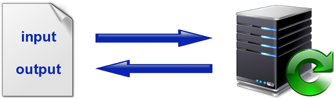

```{r echo=FALSE}
temporal <- function(expr, ms=1000, domain=getDefaultReactiveDomain()) {
  invalidateLater(ms, domain)
  expr
}
```

## What is Shiny?

Web application framework for **R** from **RStudio**

<p align="center">http://shiny.rstudio.com/</p>

<br/>

Shiny combines the computational power of R with the interactivity of the modern web

- build interactive web applications with R easily
- no HTML or JavaScript knowledge required
- reactive programming:
  output changes instantly when input is modified

## Interactive data visualization

```{r, echo=FALSE}
inputPanel(
  selectInput("n_breaks", label = "Number of bins:",
              choices = c(10, 20, 35, 50), selected = 20),
  
  sliderInput("bw_adjust", label = "Bandwidth adjustment:",
              min = 0.2, max = 2, value = 1, step = 0.2)
)

renderPlot({
  hist(faithful$eruptions, probability = TRUE, breaks = as.numeric(input$n_breaks),
       xlab = "Duration (minutes)", main = "Geyser eruption duration")
  
  dens <- density(faithful$eruptions, adjust = input$bw_adjust)
  lines(dens, col = "blue")
})
```

## Shiny widgets

```{r, echo = FALSE}

fluidPage(
  fluidRow(
    column(4,
      h3("Checkbox group"),
      wellPanel(checkboxGroupInput("checkGroup", label = "", choices = list("Choice 1" = 1, "Choice 2" = 2, "Choice 3" = 3), selected = 1))
    ),
    column(4,
      h3("Radio buttons"),
      wellPanel(radioButtons("radio", label = "", choices = list("Choice 1" = 1, "Choice 2" = 2, "Choice 3" = 3), selected = 1))
    ),
    column(4,
      h3("Select box"),
      wellPanel(selectInput("select", label = "", choices = list("Choice 1" = 1, "Choice 2" = 2, "Choice 3" = 3), selected = 1))
    )
  ),

  fluidRow(
    column(4,
      h3("Buttons"),
      wellPanel(
        actionButton("action", label = "Action"),
        br(),
        br(),
        submitButton("Submit")
      )
    ),
    column(4,
      h3("Sliders"),
      wellPanel(
        sliderInput("slider1", label = "", min = 0, max = 100, value = 50),
        sliderInput("slider2", label = "", min = 0, max = 100, value = c(25, 75))
      )
    ),
    column(4,
      h3("Numeric / Text"),
      wellPanel(
        numericInput("num", label = "", value = 1),
        textInput("text", label = "", value = "Enter text...")
      )
    )
  )

)
```

## <!--Reactive tables and data frames-->

```{r, echo = FALSE}
shinyAppDir(
  system.file("examples/03_reactivity", package="shiny"),
  options=list(
    width="100%", height="600px"
  )
)
```

## <!--Help text and submit buttons-->

```{r, echo = FALSE}
shinyAppDir(
  system.file("examples/07_widgets", package="shiny")
)
```

## <!--Tabbed panels-->

```{r, echo = FALSE}
shinyAppDir(
  system.file("examples/06_tabsets", package="shiny")
)
```

## <!--File download-->

```{r, echo = FALSE}
shinyAppDir(
  system.file("examples/10_download", package="shiny")
)
```

## <!--File upload-->

```{r, echo = FALSE}
shinyAppDir(
  system.file("examples/09_upload", package="shiny")
)
```

## Reactive programming

A way of building programs for **values that change over time**

- The value of a specific variable
- The current date/time: `r renderText(temporal(format(Sys.time())))`
- The contents of a specific file on disk
- But most commonly, user inputs:
```{r}
numericInput('x', 'Please enter a number', 5)
```

(The value of `x` is now `r renderText(input$x)`)

## Reactive programming model

<br/><br/><br/>
<p align="center"></p>

<!--
## Interactive MA plot

```{r, echo = FALSE}
shinyAppDir("/home/oles/teaching/CSAMA2015/materials/lectures/4_Thursday/Interactive_data_visualization_using_Shiny/plotMA")
```
-->
